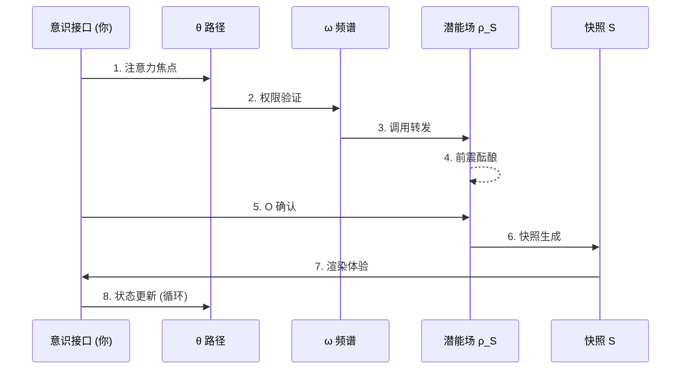

# Meta-Void-Model (MVM)

**从意识维度出发的非存在宇宙观：一个离散现实渲染的逻辑框架**

*A Structural Framework for Non-existence Cosmology based on Consciousness Dimensions*

<div align="center">


[](https://creativecommons.org/licenses/by-nc-nd/4.0/)
[](https://github.com/donhauser001/Meta-Void-Model/releases/tag/v3.0.0)
[](README.en.md)

</div>

---

## TL;DR — 10 秒入门

| 问题 | 答案 |
|------|------|
| **MVM 是什么** | 一个把现实视为"意识对潜能场的离散渲染"的宇宙模型 |
| **它不是什么** | 不是宗教，不是现有物理理论的替代品，而是一套"显现逻辑接口" |
| **核心公式** | `S := M(ρ_S ⊗ (ω, θ, O))` — 快照 = 映射(潜能场 ⊗ 意识参数) |
| **你能用它做什么** | 思辨实验、世界观设计、交互艺术、AI 模型对照、游戏宇宙构建... |

---

## 🧭 我是谁？应该从哪里开始？

<table>
<tr>
<td width="33%">

### 📖 阅读者 / 哲学爱好者

**目标**：理解完整理论

1. 从 [Release v3.0.0](https://github.com/donhauser001/Meta-Void-Model/releases/tag/v3.0.0) 下载完整原著
2. 或阅读 [archive/v3-完稿.md](archive/)
3. 再看 [spec/system-overview.md](spec/system-overview.md) 做结构化回顾

</td>
<td width="33%">

### 📐 研究者 / 想 Formalize

**目标**：形式化/证伪模型

1. 从 [spec/formal-appendix.md](spec/formal-appendix.md) 看公理定义
2. 深入 [core/](core/) 和 [engine/](engine/) 目录
3. 用 [Formalization 模板](../../issues/new?template=formalization.md) 提交

</td>
<td width="33%">

### 💻 开发者 / 做交互或仿真

**目标**：运行/扩展模拟器

1. 直接进入 [poc/](poc/)，运行 `mvm_simulator.py`
2. 看 [engine/snapshot-service/](engine/snapshot-service/) 文档
3. 参考 [poc/README.md](poc/README.md) 扩展 API

</td>
</tr>
</table>

---

## 01. 导论：一次探索性的尝试 (The Invitation)

> *"你不是在'看见一个世界'，你就是'世界在你这里被看见的那个版本'。"*

**MVM (Meta-Void-Model)** 并非意图提供一套终极真理，而是一场思想实验。它试图在现代物理学的边界疑难与第一人称意识体验之间，搭建一座逻辑桥梁。

本模型抛弃了传统的"实体构成论"，转而探讨一种基于**"显现机制"**的宇宙观。

→ 详见 [spec/manifesto.md](spec/manifesto.md) 了解开源动机

---

## 02. 核心架构 (The Architecture)

本模型由三个核心逻辑组件驱动：

### Meta-Void (元虚空/非存在)

> ⚠️ **术语澄清**：这里的 **Void** 并非物理真空或佛教"空性"，而是指**信息熵极高的、尚未被意识路径激活的结构性潜能场域**。它蕴含一切可能性，但尚未"显现"为任何确定形态。

并非绝对的虚无，而是**"尚未被激活的全频结构场"**。

它是无限现实可能性的静默叠加态（Potentiality Map）。

```
Non-Existence ≠ Nothingness
非存在 ≠ 空无

Non-Existence = Structured Potentiality awaiting activation
非存在 = 等待激活的结构性潜能
```

### Consciousness Dimensions ($\omega, \theta$)

意识在 MVM 框架中被**公理化**为宇宙的投影维度：

| 符号 | 名称 | 作用 | 形式化引用 |
|:----:|:----:|------|------------|
| $\omega$ | Spectrum | 决定了显现的**质感**与**解析度** | [Axiom C.0-C.2](spec/formal-appendix.md#意识频谱-ω) |
| $\theta$ | Path | 决定了意识接入元虚空张力结构的**特定路径** | [Axiom C.3-C.5](spec/formal-appendix.md#意识路径-θ) |

### Snapshot (五维快照)

现实的**时空量子化单元**。

每一帧"当下"都是意识在特定频率下对元虚空张力的一次**离散采样**与**渲染**。

> 📖 **完整术语表与中英对照** → [assets/glossary.md](assets/glossary.md)

<details>
<summary>🔬 <b>点击展开：单帧快照生命周期时序图</b></summary>



**完整时序图（含 6 阶段 10 步骤）** → [spec/system-overview.md](spec/system-overview.md#二-单帧快照生命周期精确时序图)

</details>

---

## 03. 形式化逻辑 (Formal Logic)

本模型将现实的生成建模为一种从"潜能场"到"显现态"的映射函数：

$$
S := M(\rho_S \otimes (\omega, \theta, O))
$$

> **Note:** 这里的 $\otimes$ 算子代表**非线性张力卷积**，暗示现实并非简单叠加，而是意识路径对背景场的一种动态扰动。

**逻辑推演：**

1. **非连续性**：由于渲染频率受限，时间并非流体，而是快照间的位移感。
2. **像素化物质**：物质质量是元虚空张力在特定 $\theta$ 路径下的"阻力表现"。
3. **主观客观化**：所谓的客观定律，是多路径 $\theta$ 在高密度区域的统计学共识。

→ 完整形式化定义见 [spec/formal-appendix.md](spec/formal-appendix.md)

---

## 04. 概念验证：可执行的宇宙观 (Proof of Concept)

```bash
# 运行 MVM 模拟器
cd poc && python mvm_simulator.py
```

我们提供了一个 Python 模拟器来**演示核心公式的逻辑结构**：

```python
# 核心公式: S := M(ρ_S ⊗ (ω, θ, O))
from poc.mvm_simulator import MVMSimulator, MVMConfig, SpectrumLevel, PathStrategy

config = MVMConfig(
    path_strategy=PathStrategy.HISTORY_BIASED,
    initial_omega=SpectrumLevel.OMEGA_MEDIUM,
    snapshot_count=50
)
sim = MVMSimulator(config)
chain = sim.run()

# 导出为 JSON (供前端可视化)
print(chain.to_json())
```

> ⚠️ 这是**概念性模拟**，用于展示逻辑结构，而非物理现实的精确模型。

→ [查看完整模拟器文档](poc/README.md)

---

## 05. 为什么在 GitHub 开源？

理论不应是封闭的堡垒，而应是可进化的接口。

我选择开源是为了：

- 🔬 **逻辑证伪**：邀请跨学科研究者指出模型中的逻辑断裂点 → [提交 Refutation](../../issues/new?template=refutation.md)
- 📐 **数学形式化**：寻找更严密的数学工具来描述 $\theta$ 路径 → [提交 Formalization](../../issues/new?template=formalization.md)
- 🌿 **思想分支**：支持基于 MVM 原理的二次创作与应用探索

**参与方式：**

| 类型 | 去哪里 | 适合场景 |
|------|--------|----------|
| 💬 [Discussions](../../discussions) | 开放式讨论 | 哲学辩论、想法冲刺、应用探索、翻译协作 |
| 🎯 [Issues](../../issues) | 具体问题 | 逻辑漏洞、形式化建议、代码 Bug、文档错误 |

→ 详见 [spec/manifesto.md](spec/manifesto.md)

---

## 06. 边界与未解问题 (Boundary & Open Questions)

MVM 并不声称已解决一切。以下是我主动披露的**逻辑边界**：

| 问题域 | 待解决 |
|--------|--------|
| **$\theta$ 的离散阈值** | 意识路径是否存在最小量子化单位？其跃迁机制为何？ |
| **多主体同步** | 不同意识路径如何在同一"快照帧"中达成显现共识？ |
| **递归悖论** | 若意识本身也是显现，那么"观察意识"的主体是谁？ |
| **因果倒置** | 在非时间优先的框架下，如何重新定义因果律？ |

> *我欢迎通过 [GitHub Discussions](../../discussions) 或 [Issues](../../issues) 对上述问题进行形式化攻击。*

---

## 07. 系统导航 (System Navigation)

> **快速导航核心模块**

| 模块 | 职责 | 入口 |
|:----:|------|------|
| 📋 `spec/` | 系统规范与设计原则 | [→ paradigm-shift](spec/paradigm-shift.md) |
| 📐 `spec/formal-appendix` | **公理化附录** | [→ formal-appendix](spec/formal-appendix.md) |
| 🔧 `core/meta-void` | 元虚空定义 | [→ tension-structure](core/meta-void/tension-structure.md) |
| 🔧 `core/consciousness` | 意识维度参数 | [→ spectrum-omega](core/consciousness/spectrum-omega.md) |
| ⚙️ `engine/snapshot-service` | 快照渲染服务 | [→ discrete-generation](engine/snapshot-service/discrete-generation.md) |
| ⚙️ `engine/mapping-logic` | 映射引擎 | [→ formula-S](engine/mapping-logic/formula-S.md) |
| 📦 `modules/` | 扩展模块 | [→ life-definition](modules/life-definition.md) |
| 🔬 `lab/` | 实验与前瞻 | [→ ai-manifestation](lab/research/ai-manifestation.md) |
| 🧪 `poc/` | 概念验证模拟器 | [→ mvm_simulator.py](poc/mvm_simulator.py) |
| 📖 **完整索引** | SUMMARY | [→ 系统导航](SUMMARY.md) |
| 📁 **原始文稿** | 完整原著存档 | [→ archive/](archive/) |
| 🏷️ **正式发布** | v3.0.0 (PDF/HTML/DOCX) | [→ Releases](https://github.com/donhauser001/Meta-Void-Model/releases/tag/v3.0.0) |

> 💡 **提示**：每个模块文件末尾都包含 `📚 Research & Philosophical Notes` 章节，保留了原著 20 万字中的哲学思辨、直觉类比和跨学科对话。

---

## 08. 仓库结构 (Repository Layout)

```
├── README.md
├── README.en.md                        # 🌐 English version
├── CONTRIBUTING.md
├── SUMMARY.md                          # 系统导航索引
├── spec/                               # 系统规范
│   ├── paradigm-shift.md
│   ├── formal-appendix.md              # 📐 公理化附录 (NEW)
│   ├── manifesto.md                    # 📜 开源宣言 (NEW)
│   ├── design-principles.md
│   └── system-overview.md
├── core/                               # 核心机制
│   ├── meta-void/
│   │   ├── tension-structure.md
│   │   └── potentiality-field.md
│   └── consciousness/
│       ├── spectrum-omega.md
│       ├── path-theta.md
│       └── distributed-network.md
├── engine/                             # 渲染与映射引擎
│   ├── snapshot-service/
│   │   ├── discrete-generation.md
│   │   └── snapshot-chains.md
│   └── mapping-logic/
│       ├── formula-S.md
│       ├── api-mapping.md
│       └── integral-model.md
├── modules/                            # 扩展模块
│   ├── life-definition.md
│   └── macro-entities.md
├── lab/                                # 实验与前瞻
│   ├── verification/
│   └── research/
├── poc/                                # 🧪 概念验证模拟器
│   ├── README.md
│   └── mvm_simulator.py
├── archive/                            # 📁 原始文稿存档
│   └── v3-完稿.md
├── .github/                            # 🛠️ GitHub 配置
│   └── ISSUE_TEMPLATE/
└── assets/                             # 静态资产
    ├── glossary.md
    └── diagrams/
```

---

## 09. 许可证 (License)

本项目采用**分层授权**策略：

| 目录/内容 | 许可证 | 说明 |
|-----------|--------|------|
| `archive/`、所有 `.md` 文档 | **CC BY-NC-ND 4.0** | 保护原著完整性，禁止商业演绎 |
| `poc/` 代码、未来可视化 Demo | **MIT** | 允许自由修改、商业使用 |
| Issue 模板、GitHub 配置 | **CC0** | 公共领域，任意使用 |

> 💡 **为什么分层？** 我们希望保护理论文本的完整性，同时鼓励开发者基于 `poc/` 代码构建世界观实现、交互艺术和游戏原型。

详见各目录下的 `LICENSE` 文件。

---

<div align="center">

*"在这场关于显现的集体沉思中，我不提供真理，只提供一种观察真理的接口。"*

**[English Version →](README.en.md)**

</div>

---

> 📌 如果你在阅读 **v3 完稿** 时发现了逻辑跳跃或断裂点，请立即查看 **[CONTRIBUTING.md](CONTRIBUTING.md)**。
