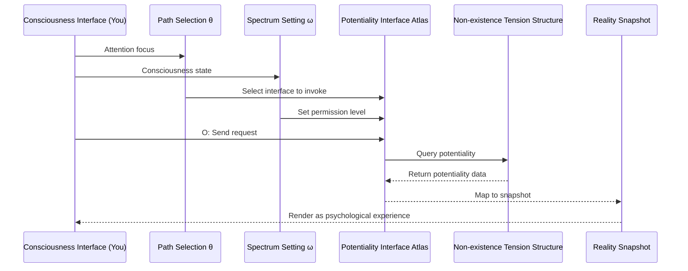

# API Mapping | Mapping Theory and Invocation Logic

[](../zh/api-mapping.md)

> **Module Responsibility**: Elucidate MVM's core ontological paradigm—Mapping Theory—explaining reality generation mechanism through API analogy  
> **Dependencies**: `engine/mapping-logic/formula-S.md`, `core/meta-void/*`  
> **Depended By**: `engine/mapping-logic/integral-model.md`, `modules/life-definition.md`

---

## 📋 Executive Summary

```
┌─────────────────────────────────────────────────────────────────────────┐
│            Mapping Theory Core Paradigm (映射论核心范式)                  │
├─────────────────────────────────────────────────────────────────────────┤
│                                                                         │
│  ╔═══════════════════════════════════════════════════════════════════╗ │
│  ║                                                                   ║ │
│  ║   Cosmic Manifestation ≈ Consciousness Path(θ) × Potentiality    ║ │
│  ║                          Interface Atlas                          ║ │
│  ║                                                                   ║ │
│  ╚═══════════════════════════════════════════════════════════════════╝ │
│                                                                         │
│  Paradigm Comparison:                                                   │
│    ❌ Compositionism: Universe = Σ Material Building Blocks (assembled) │
│    ✅ Mapping Theory: Universe = invoke(θ, ω, O) → Potentiality        │
│                       Interface (manifested through mapping)            │
│                                                                         │
│  Core Propositions:                                                     │
│    Reality is not "composed," but "invoked"                             │
│    Particles are not "bricks," but "pixels"                             │
│    You are not "observer," but "execution environment"                  │
│                                                                         │
└─────────────────────────────────────────────────────────────────────────┘
```

---

## 1. Core Axioms (Mapping Axioms)

### Axiom M.1 — Invocation Priority Principle

```
┌─────────────────────────────────────────────────────────────────────────┐
│  AXIOM M.1  Invocation Priority Principle                              │
│                                                                         │
│  Reality's manifestation originates from "Invocation," not             │
│  "Composition."                                                         │
│                                                                         │
│  Traditional: Reality = assemble(particles)     // Particle assembly   │
│  MVM:         Reality = invoke(θ, ω, O) → API   // Interface invocation│
│                                                                         │
│  Corollary: Without invocation, no manifestation occurs                │
│                                                                         │
└─────────────────────────────────────────────────────────────────────────┘
```

### Axiom M.2 — Interface Atlas Principle

```
┌─────────────────────────────────────────────────────────────────────────┐
│  AXIOM M.2  Interface Atlas Principle                                  │
│                                                                         │
│  The functional expression of Non-existence tension structure is       │
│  "Potentiality Interface Atlas"—a structured catalog defining all      │
│  possible manifestation patterns and rules.                            │
│                                                                         │
│  Characteristics:                                                       │
│    - Multi-layered: From basic interfaces to complex interfaces        │
│    - Interconnected: Dependencies and invocation relations exist       │
│      between interfaces                                                 │
│    - Possibly Dynamic: The atlas itself may evolve with universe       │
│                                                                         │
│  Analogy: Universe's "API Documentation" + "Backend Service"           │
│                                                                         │
└─────────────────────────────────────────────────────────────────────────┘
```

### Axiom M.3 — Execution Environment Principle

```
┌─────────────────────────────────────────────────────────────────────────┐
│  AXIOM M.3  Execution Environment Principle                            │
│                                                                         │
│  You (consciousness node) are the "execution environment" through      │
│  which reality manifests—the locus where API invocation occurs,        │
│  the terminal where responses are decoded and rendered.                │
│                                                                         │
│  Your Role:                                                            │
│    ❌ Creator: You cannot author new interface rules                   │
│    ❌ Autonomous Invoker: Your invocations are constrained by          │
│       probability density                                              │
│    ✅ Execution Environment: You are the necessary locus where         │
│       invocation occurs and response renders                           │
│                                                                         │
│  Corollary: You do not "possess" consciousness; you "are" the          │
│             interface through which consciousness manifests            │
│                                                                         │
└─────────────────────────────────────────────────────────────────────────┘
```

---

## 2. Paradigm Comparison Matrix

### 2.1 Compositionism vs Mapping Theory

| Dimension | Compositionism | Mapping Theory |
|-----------|----------------|----------------|
| **Cosmic Essence** | Stacking of material building blocks | Invocation of potentiality interfaces |
| **Basic Unit** | Particle (brick) | Snapshot (pixel) |
| **Generation Mode** | Combination → Whole | Invocation → Manifestation |
| **Causal Mechanism** | Material interaction | Invocation-response chain |
| **Spacetime** | Container (background) | Coordinates (anchor parameters) |
| **Consciousness** | Byproduct (emergence) | Core driver (invoker) |
| **You** | Observer/bystander | Execution environment/interface |
| **Law Origin** | Physical laws (a priori) | Interface stability (structural) |
| **Cognitive Mode** | Passive reflection | Active invocation |

### 2.2 Why Mapping Theory Excels

| Challenge | Compositionism's Dilemma | Mapping Theory's Explanation |
|-----------|--------------------------|------------------------------|
| **Quantum Superposition** | How can particles simultaneously exist in multiple states? | Interface remains in multi-response mode superposition before invocation |
| **Measurement Collapse** | Why does observation alter reality? | O triggers selection of one mapping mode |
| **Quantum Entanglement** | How is action at a distance possible? | Interface atlas is a non-locally correlated network |
| **Hard Problem of Consciousness** | How does matter produce experience? | Consciousness is invoker, not invoked |
| **Arrow of Time** | Why is time unidirectional? | Snapshot chain sequence numbers are navigation coordinates, not flow direction |

---

## 3. API Analogy Elaboration

### 3.1 Core Mapping Table

```
┌─────────────────────────────────────────────────────────────────────────┐
│                    MVM ↔ API Concept Mapping Table                      │
├─────────────────────────────────────────────────────────────────────────┤
│                                                                         │
│  MVM Concept              API Analogy             Function              │
│  ─────────────────────────────────────────────────────────────────────  │
│  Non-existence Tension    Backend Server/         Stores all            │
│  Structure                Cloud Platform          potentiality          │
│                                                                         │
│  Potentiality Interface   API Documentation/      Defines invocable     │
│  Atlas                    Endpoint List           interfaces            │
│                                                                         │
│  Consciousness Path θ     API Request/            Selects resources     │
│                           Invocation Sequence     to access             │
│                                                                         │
│  Consciousness Spectrum ω Permission Key/         Determines accessible │
│                           Access Level            depth                 │
│                                                                         │
│  Observation Action O     Send Request/           Triggers data return  │
│                           Execute Command                               │
│                                                                         │
│  Reality Snapshot S       API Response Data       Actually manifested   │
│                                                   content               │
│                                                                         │
│  Consciousness Interface  Client/Execution        Parses and renders    │
│  (You)                    Environment             response              │
│                                                                         │
└─────────────────────────────────────────────────────────────────────────┘
```

### 3.2 Invocation Flow Diagram (Simplified)



> 📌 **Complete Sequence Diagram** (with 6 phases, 10 steps) see → [spec/system-overview.md](../../spec/system-overview.md#二-单帧快照生命周期精确时序图)

### 3.3 Permission Level Analogy (ω)

```
ω as "API Permission Key":

┌─────────────────────────────────────────────────────────────────────────┐
│  Permission Level   Accessible Interfaces      Returned Data            │
├─────────────────────────────────────────────────────────────────────────┤
│  ωₗ (Low-freq)     Public interfaces          Summary/low resolution   │
│                     Physical/physiological     Sensory direct           │
│                     layer reality              presentation             │
│                     Example: /basic/sensory    {"color": "red"}         │
├─────────────────────────────────────────────────────────────────────────┤
│  ωₘ (Mid-freq)     Standard interfaces        Complete data            │
│                     Symbolic/social layer      Conceptual/logical       │
│                     reality                    structure                │
│                     Example: /standard/        {"concept": "...",       │
│                     cognitive                  "logic":...}             │
├─────────────────────────────────────────────────────────────────────────┤
│  ωₕ (High-freq)    Privileged/internal        Complete + metadata      │
│                     interfaces                                          │
│                     Structural/source          Deep patterns/holistic   │
│                     layer reality              insight                  │
│                     Example: /internal/        {"pattern": ...,         │
│                     structure                  "meta": ...}             │
└─────────────────────────────────────────────────────────────────────────┘
```

---

## 4. Repositioning of "You"

### 4.1 Role Comparison

| Traditional Position | Mapping Theory Position | Distinction |
|---------------------|------------------------|-------------|
| **Creator** | **Interface** | You cannot author rules, but you are the locus where rules execute |
| **Observer** | **Execution Environment** | You are not "watching" reality; reality "occurs" within you |
| **Owner** | **Channel** | You do not "possess" consciousness; consciousness "manifests" through you |
| **Subject** | **Focus** | You are not world's center, but a focal point of cosmic manifestation |

### 4.2 Three Layers of Execution Environment

```
Three Layers of Meaning as "Execution Environment":

┌─────────────────────────────────────────────────────────────────────────┐
│  Layer 1: You Are the "Interface" Itself                               │
├─────────────────────────────────────────────────────────────────────────┤
│  Your body/brain is the physical anchor point for consciousness-       │
│  potentiality interaction                                               │
│  You are the information conversion hub: Potentiality response →       │
│  psychological experience                                               │
│  Your existence is this interface's existence                          │
└─────────────────────────────────────────────────────────────────────────┘
                                    │
                                    ▼
┌─────────────────────────────────────────────────────────────────────────┐
│  Layer 2: You Are the "Execution Locus"                                │
├─────────────────────────────────────────────────────────────────────────┤
│  Snapshot generation must complete within a concrete "locus"           │
│  You are the necessary condition for invocation-response-manifestation │
│  flow to close the loop                                                 │
│  Without execution environment, no "sense of reality" exists           │
└─────────────────────────────────────────────────────────────────────────┘
                                    │
                                    ▼
┌─────────────────────────────────────────────────────────────────────────┐
│  Layer 3: You Are a "Unique" Execution Environment                     │
├─────────────────────────────────────────────────────────────────────────┤
│  Each consciousness interface is unique                                │
│  Your structure, history, ω, θ together constitute a unique            │
│  "runtime configuration"                                                │
│  Same invocation produces different rendering results in different     │
│  environments                                                           │
└─────────────────────────────────────────────────────────────────────────┘
```

---

## 5. Philosophical Implications of Mapping Theory

### 5.1 Ontological Reconstruction

| Traditional Ontology | Mapping Theory Ontology |
|---------------------|------------------------|
| Existence = property of material entities | Existence = occurrence of manifestation |
| Reality = things independent of observation | Reality = relation of invocation and response |
| Truth = correspondence of proposition and fact | Truth = consistency of interface rules |
| Causality = transmission between matter | Causality = structural coupling of invocation chains |

### 5.2 Epistemological Reconstruction

```
New Understanding of Cognition:

  Traditional: Cognition = passive reflection (mirror)
        Consciousness → Perception → External reality
        
  Mapping Theory: Cognition = active invocation (API client)
          Consciousness → invoke(θ,ω,O) → Potentiality interface → 
          Response → Decoding
          
  Key Distinction:
    - What you can know depends on what you can invoke
    - Invocation scope is constrained by θ path and ω permissions
    - Cognition itself is a generative interactive action
```

### 5.3 Core Insight

> **"You are not constructing the universe; the universe manifests through you."**

```
Traditional: You ─── cognize/observe ───▶ External universe (pre-existing)

Mapping Theory:
  
     ┌───────────────────────────────────────────────┐
     │           Potentiality Interface Atlas         │
     │           (Non-existence Tension Structure)    │
     └───────────────────┬───────────────────────────┘
                         │
                    invoke (θ, ω, O)
                         │
                         ▼
               ┌─────────────────┐
               │ You (Execution  │
               │   Environment)  │
               │                 │
               │ ← render/       │
               │   manifest ←    │
               └─────────────────┘
                         │
                         ▼
                   Reality Snapshot S
                   (Your experience)

Key: Universe is not "out there" waiting to be seen
     Universe "manifests through you"
```

---

## 6. Core Insights Summary

> **Insight A.1** (Invocation, Not Construction)  
> Reality is the result of "invocation," not the product of "assembly." Without invocation, no manifestation.

> **Insight A.2** (Interface, Not Entity)  
> Universe's foundation is the potentiality interface atlas, not material entities. Understanding universe = understanding interface rules.

> **Insight A.3** (Environment, Not Observer)  
> You are the "execution environment" where reality manifests, not an "observer" standing outside. Reality occurs within you.

> **Insight A.4** (Symbiosis, Not Separation)  
> You and universe exist in interactive symbiosis, not subject-object opposition. You are a focal point of universe's self-manifestation.

---

## 7. Navigation Index

### From This Document

| To Learn About... | Go To |
|-------------------|-------|
| Core Generation Formula S | [→ formula-S.md](formula-S.md) |
| Cosmic Integral Model | [→ integral-model.md](integral-model.md) |
| Potentiality Field Structure | [→ ../../core/meta-void/potentiality-field.md](../../core/meta-void/potentiality-field.md) |
| Tension Structure | [→ ../../core/meta-void/tension-structure.md](../../core/meta-void/tension-structure.md) |
| Consciousness Path θ | [→ ../../core/consciousness/path-theta.md](../../core/consciousness/path-theta.md) |
| Consciousness Spectrum ω | [→ ../../core/consciousness/spectrum-omega.md](../../core/consciousness/spectrum-omega.md) |

### Terminology Quick Reference

- **Mapping Theory** → [glossary](../../assets/glossary.md#mapping-theory)
- **Potentiality Interface Atlas** → [glossary](../../assets/glossary.md#potential-interface-atlas)
- **Execution Environment** → [glossary](../../assets/glossary.md#execution-environment)

---

## 📚 Research & Philosophical Notes

> *This section preserves philosophical speculation and case studies from the original text regarding "Mapping Theory and API Analogy," serving as intuitive supplement to the formal axiomatic system.*

### Intuitive Analogies

> **Backend Database Access**: A complex website or application stores core data (user information, product catalog, article content, etc.) in backend databases. When no user accesses or performs specific operations, this data is invisible to frontend users. Yet this invisibility does not mean the database is empty—**the database's table structure, data records, and APIs for interaction have already been designed and implemented (structural potentiality)**. When a user initiates a request through the frontend interface (consciousness path access), backend logic is triggered (activation), data is retrieved and processed from the database, returned via API to frontend, finally displayed on user's screen (manifested snapshot).

> **Cloud Service Invocation**: The phone app you use may actually be a "thin client"—real computation and data processing complete in the cloud. **The interface you see is merely "rendering" of cloud computation results**. Mapping Theory views you as a similar "client"—reality's "backend processing" occurs in Non-existence tension structure; you receive "rendered frontend display."

> **Light Refracting Through Prism**: White light itself contains potentiality of all colors, but only through prism refraction does it manifest as rainbow. **You are the prism, Non-existence tension is white light, reality snapshot is refracted rainbow.** Different prism angles (different ω and θ) produce different spectra (different reality content).

### Case Studies

**Opening a Webpage**:
> When you enter a URL in browser and press enter, you send an HTTP request (similar to θ path initiation). Server receives request, validates permissions (similar to ω permission level), queries database (accessing potentiality structure), processes data, finally returns HTML/CSS/JS (generating snapshot S). **The webpage you see does not "pre-exist"—it is "rendered" at the moment of your request.** Next refresh may return different content (dynamic website real-time generation).

**Conversing with ChatGPT**:
> When you ask AI a question, your question (θ path) is sent to backend model. The model has not "pre-prepared" your answer—**it "generates" the response in real-time through probabilistic token generation process (similar to foreshock-activation) after receiving your input**. Same question may yield slightly different answers each time (probability density sampling).

### Cross-disciplinary Dialogues

**Fundamental Divergence from Compositionism**:
> Traditional "Compositionism" views universe as a tower of blocks "assembled" from fundamental particles. **Mapping Theory maintains that reality is not "assembled" but "invoked"—not bottom-up stacking but projection from potentiality to manifestation.** This explains why no "ultimate brick" is found at the most fundamental particle level—because particles themselves are projections, not building blocks.

**Dialogue with Platonic Theory of Forms**:
> Plato believed the phenomenal world is projection of "Forms." **Mapping Theory can be viewed as modern restatement of Plato—Non-existence tension structure resembles "realm of Forms," reality snapshots resemble "phenomenal realm," consciousness path resembles soul's process of "extracting" forms from realm of Forms.** However, Mapping Theory does not presuppose eternal perfection of Form realm, but emphasizes dynamism and activatability of potentiality structure itself.

**Dialogue with Eastern "Dependent Origination" Thought**:
> Buddhist "Pratītyasamutpāda" (dependent origination) emphasizes that all phenomena arise through conditions coming together, possessing no independent self-nature. **Mapping Theory's "invocation not construction" logic resonates—no reality snapshot "exists independently"; they all generate from potentiality structure through "conditions coming together" under specific conditions (specific combinations of ω, θ, O).**

### Open Questions

1. **Designer of API**: If reality generation follows certain "interface specifications," who/what "designed" this specification? Or is it an intrinsic property of potentiality structure itself?

2. **Error Handling**: In API invocation, "404 Not Found" or "500 Server Error" may occur. Do similar "failure modes" exist in reality generation? Can mental illness and consciousness disorders be understood from this perspective?

3. **API Versioning**: Is potentiality interface atlas fixed, or does it update with "cosmic evolution"? If updating, what drives this "interface upgrade"?

> *← Return to [Mapping Theory vs Compositionism](#3-映射论-vs-构成论)*

---

<div align="center">

*"You are not building the world with blocks; the world refracts its brilliance through you as prism."*

</div>

