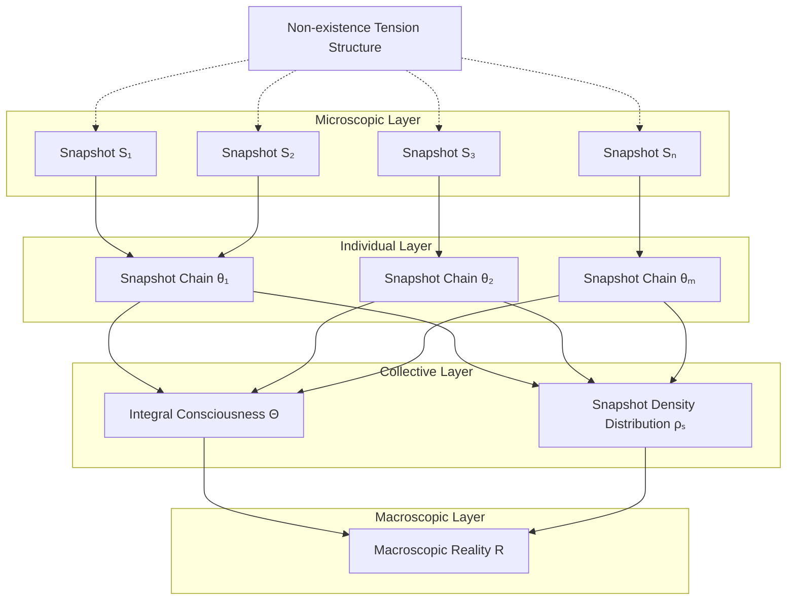

# Integral Model | Cosmic Integration and Holistic Manifestation

[](../zh/integral-model.md)

> **Module Responsibility**: Connect microscopic snapshot generation with macroscopic cosmic picture, elucidate holistic manifestation mechanism  
> **Dependencies**: `engine/mapping-logic/formula-S.md`, `engine/mapping-logic/api-mapping.md`  
> **Depended By**: `modules/life-definition.md`, `spec/paradigm-shift.md`

---

## 📋 Executive Summary

```
┌─────────────────────────────────────────────────────────────────────────┐
│              Cosmic Integral Model                                      │
├─────────────────────────────────────────────────────────────────────────┤
│                                                                         │
│  Core Question:                                                         │
│    Microscopic: Consciousness nodes generate snapshots S frame by frame│
│    Macroscopic: What we see is stable, orderly, grand universe         │
│    Gap: Microscopic generation ═══?═══ Macroscopic reality             │
│                                                                         │
│  Core Answer:                                                           │
│                                                                         │
│    ╔═══════════════════════════════════════════════════════════════╗   │
│    ║                                                               ║   │
│    ║   Macroscopic Reality R = ∫ f(Θ, ρₛ) dV dt                   ║   │
│    ║                                                               ║   │
│    ║   Θ  = Integral Consciousness State (collection/field/       ║   │
│    ║        network of all paths)                                  ║   │
│    ║   ρₛ = Local Snapshot Density (generation intensity/         ║   │
│    ║        complexity)                                            ║   │
│    ║                                                               ║   │
│    ╚═══════════════════════════════════════════════════════════════╝   │
│                                                                         │
│  Essential Proposition:                                                 │
│    Universe is not preset stage                                        │
│    Universe is integral integration effect of all manifestation events │
│                                                                         │
└─────────────────────────────────────────────────────────────────────────┘
```

---

## 1. Core Axioms (Integral Axioms)

### Axiom I.1 — Integration Emergence Principle

```
┌─────────────────────────────────────────────────────────────────────────┐
│  AXIOM I.1  Integration Emergence Principle                            │
│                                                                         │
│  Macroscopic cosmic reality R is not pre-existing entity,              │
│  but emergent effect of countless microscopic snapshot generation      │
│  events S integrated and superposed.                                    │
│                                                                         │
│  R ≠ Preset existence                                                   │
│  R = Σ S (statistical effect after integration)                        │
│                                                                         │
│  Corollary: Objectivity is emergent, not a priori                      │
│                                                                         │
└─────────────────────────────────────────────────────────────────────────┘
```

### Axiom I.2 — Integral Consciousness Principle

```
┌─────────────────────────────────────────────────────────────────────────┐
│  AXIOM I.2  Integral Consciousness Principle                           │
│                                                                         │
│  A macroscopic variable Θ exists representing cosmic integral          │
│  consciousness activity state, transcending any single individual      │
│  path θᵢ.                                                               │
│                                                                         │
│  Understanding Approaches (possibly coexisting):                       │
│    - Set Theory: Θ = Statistical distribution of {θ₁, θ₂, ..., θₙ}    │
│    - Field Theory: Θ is universe-pervading consciousness field,        │
│                    θⱼ is local excitation                              │
│    - Network Theory: Θ is holistic dynamics of consciousness           │
│                      node network                                       │
│                                                                         │
│  Corollary: Individual is focal point of whole; whole manifests        │
│             through individual                                          │
│                                                                         │
└─────────────────────────────────────────────────────────────────────────┘
```

### Axiom I.3 — Snapshot Density Principle

```
┌─────────────────────────────────────────────────────────────────────────┐
│  AXIOM I.3  Snapshot Density Principle                                 │
│                                                                         │
│  Different regions of universe possess different "local snapshot       │
│  density" ρₛ, reflecting that region's reality generation intensity,   │
│  frequency, and complexity.                                             │
│                                                                         │
│  Meaning of ρₛ:                                                         │
│    - Generation Frequency: Density of snapshot refresh per unit        │
│      spacetime                                                          │
│    - Information Complexity: Average structural layer of generated     │
│      snapshots                                                          │
│    - Stability: "Solidity" and predictability of reality               │
│                                                                         │
│  Relation to Potentiality Structure Density:                           │
│    ρₛ ∝ Potentiality density × Consciousness access intensity          │
│                                                                         │
└─────────────────────────────────────────────────────────────────────────┘
```

---

## 2. Model Structure

### 2.1 Hierarchical Architecture

```
Integration Hierarchy from Microscopic to Macroscopic:

┌─────────────────────────────────────────────────────────────────────────┐
│  Level 4: Macroscopic Cosmic Reality R                                 │
│  ─────────────────────────────────────────────────────────────────────  │
│  │ Holistic cosmic state: Physical laws, cosmic evolution, spacetime   │
│  │ structure                                                           │
│  │ Generation mechanism: Integral integration of all levels            │
│  │ Formula: R = ∫∫∫∫ f(Θ, ρₛ) dV dt                                    │
└───────────────────────────────┬─────────────────────────────────────────┘
                                │ Integration
                                ▼
┌─────────────────────────────────────────────────────────────────────────┐
│  Level 3: Collective Consciousness Effect                              │
│  ─────────────────────────────────────────────────────────────────────  │
│  │ Statistical average and resonance effect of multiple nodes          │
│  │ Manifestation: Social trends, cultural patterns, zeitgeist          │
│  │ Parameter: Θ (integral consciousness state)                         │
└───────────────────────────────┬─────────────────────────────────────────┘
                                │ Convergence
                                ▼
┌─────────────────────────────────────────────────────────────────────────┐
│  Level 2: Individual Snapshot Chain (Reality Stream)                   │
│  ─────────────────────────────────────────────────────────────────────  │
│  │ Continuous snapshot sequence of single consciousness node           │
│  │ Manifestation: Personal continuous experience, memory, identity     │
│  │ Formula: {Sₙ₋₁ → Sₙ → Sₙ₊₁}                                         │
└───────────────────────────────┬─────────────────────────────────────────┘
                                │ Accumulation
                                ▼
┌─────────────────────────────────────────────────────────────────────────┐
│  Level 1: Single-Frame Snapshot S                                      │
│  ─────────────────────────────────────────────────────────────────────  │
│  │ Basic generation unit of reality                                    │
│  │ Formula: S := S(x,y,z | t | ω, θ, O)                                │
│  │ Parameters: Spatiotemporal coordinates, consciousness spectrum,     │
│  │             path, observation action                                │
└─────────────────────────────────────────────────────────────────────────┘
```

### 2.2 Integration Flow Diagram



---

## 3. Explanatory Power Analysis

### 3.1 Explanation of Macroscopic Phenomena

| Phenomenon | Traditional Explanation | Integral Model Explanation |
|------------|------------------------|---------------------------|
| **Physical Constant Stability** | Preset cosmic parameters | Statistical stability of numerous invocations at high-probability interfaces |
| **Reality Objectivity** | Reality independent of observation | Statistical consistency of multiple paths in attractor regions |
| **Cosmic Evolution** | Matter moving according to laws | Dynamic change of Θ and ρₛ |
| **Zeitgeist** | Cultural/ideological transmission | Holistic fluctuation/phase transition of Θ |
| **Physical Laws** | A priori natural laws | Extremely stable interface rules |
| **Cosmic Structure** | Formation through gravitational collapse | Spatial distribution pattern of ρₛ |

### 3.2 Key Insights

```
Why does universe appear "objective" and "stable"?

┌─────────────────────────────────────────────────────────────────────────┐
│  Sources of Objectivity                                                │
├─────────────────────────────────────────────────────────────────────────┤
│                                                                         │
│  1. Interface Stability:                                               │
│     Underlying potentiality interfaces possess extremely high          │
│     structural stability                                                │
│     Example: Physical law interfaces essentially unchanged              │
│                                                                         │
│  2. High-Probability Attractors:                                       │
│     Numerous paths are "attracted" to same high-probability regions    │
│     Example: Everyone "sees" the same moon                             │
│                                                                         │
│  3. Statistical Averaging:                                             │
│     Macroscopic effects are statistical results of countless           │
│     microscopic invocations                                            │
│     Example: Temperature is statistical average of molecular motion    │
│                                                                         │
│  Conclusion:                                                            │
│    Objectivity = Structural constraints × Statistical effects          │
│    Not "preset," but "emergent"                                        │
│                                                                         │
└─────────────────────────────────────────────────────────────────────────┘
```

---

## 4. Core Proposition: Manifestation, Not Construction

### 4.1 Paradigm Leap

| From (Compositionism) | To (Mapping Theory/Integral Model) |
|-----------------------|-----------------------------------|
| Universe is stacking of matter | Universe is integration of manifestation |
| You observe an external universe | Universe manifests through you |
| You possess consciousness | Consciousness occurs through you |
| World is there waiting for you to see | World "exists" because of your existence |

### 4.2 Core Statement

```
┌─────────────────────────────────────────────────────────────────────────┐
│                                                                         │
│  "You are not constructing the universe; the universe manifests        │
│   through you"                                                          │
│                                                                         │
├─────────────────────────────────────────────────────────────────────────┤
│                                                                         │
│  Meaning Analysis:                                                      │
│                                                                         │
│  1. You are not "constructor":                                         │
│     You cannot arbitrarily create physical laws or change interface    │
│     rules                                                               │
│     Your generation capacity operates within structural constraints    │
│                                                                         │
│  2. You are "manifestation channel":                                   │
│     Cosmic potentiality transforms into concrete reality through       │
│     you as focal point                                                  │
│     You are indispensable link in universe's self-manifestation        │
│     process                                                             │
│                                                                         │
│  3. "Manifests through you":                                           │
│     Not "for you," but "via you"                                       │
│     Your state of existence directly participates in shaping           │
│     manifestation results                                               │
│     Universe's action of "becoming reality" occurs right here,         │
│     within you                                                          │
│                                                                         │
└─────────────────────────────────────────────────────────────────────────┘
```

### 4.3 Philosophical Implications

```
┌─────────────────────────────────────────────────────────────────────────┐
│  Neither Omnipotent Arrogance nor Nihilistic Passivity                 │
├─────────────────────────────────────────────────────────────────────────┤
│                                                                         │
│  Breaking Arrogance:                                                   │
│    You are not master of universe                                      │
│    Your generation capacity is structurally constrained                │
│                                                                         │
│  Avoiding Nihilism:                                                    │
│    You are necessary locus where manifestation occurs                  │
│    Your existence possesses irreplaceable ontological value            │
│                                                                         │
│  Your Role:                                                            │
│    A unique viewpoint on cosmic hologram                               │
│    Through you, a portion of universe is illuminated                   │
│    Your uniqueness imprints manifestation with one-of-a-kind mark      │
│                                                                         │
└─────────────────────────────────────────────────────────────────────────┘
```

---

## 5. Model Limitations and Openness

### 5.1 Challenges Faced

| Challenge | Description | Status |
|-----------|-------------|--------|
| **Concept Operationalization** | How to quantify Θ and ρₛ? | Open |
| **Interaction Function** | What is specific form of f(Θ, ρₛ)? | Open |
| **Integration Mechanism** | How do local snapshots "superpose" into macroscopic? | Open |
| **Verifiability** | How to experimentally test? | Open |
| **Physics Interface** | How to precisely interface with general relativity/quantum field theory? | Open |

### 5.2 Model Positioning

```
Current Stage Positioning of Integral Model:

  ❌ Is Not: Precisely calculable physical theory
  ✅ Is:     Conceptual integration framework
  
  Value:
    - Provides approach connecting microscopic and macroscopic
    - Inspires new thinking about cosmic holism
    - Provides starting point for future formalization exploration
```

---

## 6. Prospect: Manifestation Capacity of Life

```
Next Question:

┌─────────────────────────────────────────────────────────────────────────┐
│  If universe's essence is "manifestation" not "composition,"           │
│  must "life" also be redefined from perspective of                     │
│  "manifestation capacity"?                                              │
├─────────────────────────────────────────────────────────────────────────┤
│                                                                         │
│  Traditional Life Definition: Metabolism, growth, reproduction...      │
│                                                                         │
│  MVM Life Definition (Proposal):                                       │
│    Life = System's capacity to continuously, stably invoke             │
│           potentiality interfaces and generate reality snapshots       │
│           "Manifestation Capacity"                                     │
│                                                                         │
│  Corollaries:                                                          │
│    - Manifestation capacity may be new criterion for measuring         │
│      "vitality"                                                        │
│    - May apply to organisms, AI, even linguistic systems               │
│                                                                         │
│  See → [modules/life-definition.md]                                    │
│                                                                         │
└─────────────────────────────────────────────────────────────────────────┘
```

---

## 7. Core Insights Summary

> **Insight I.1** (Integration, Not Aggregation)  
> Macroscopic reality is "integral integration" of microscopic snapshots, not simple "aggregation." Integration produces new emergent properties.

> **Insight I.2** (Emergence, Not Preset)  
> Objectivity and stability are emergent statistical effects, not preset cosmic properties.

> **Insight I.3** (Manifestation, Not Construction)  
> You are not "constructing" universe; universe "manifests through you." You are focal point of universe's self-manifestation.

> **Insight I.4** (Value, Not Passivity)  
> As necessary link in manifestation, your existence possesses irreplaceable ontological value.

---

## 8. Navigation Index

### From This Document

| To Learn About... | Go To |
|-------------------|-------|
| Core Generation Formula S | [→ formula-S.md](formula-S.md) |
| API Mapping Analogy | [→ api-mapping.md](api-mapping.md) |
| Snapshot Chains and Causality | [→ ../snapshot-service/snapshot-chains.md](../snapshot-service/snapshot-chains.md) |
| Distributed Consciousness Network | [→ ../../core/consciousness/distributed-network.md](../../core/consciousness/distributed-network.md) |
| New Definition of Life | [→ ../../modules/life-definition.md](../../modules/life-definition.md) |
| Paradigm Shift | [→ ../../spec/paradigm-shift.md](../../spec/paradigm-shift.md) |

### Terminology Quick Reference

- **Cosmic Integral Model** → [glossary](../../assets/glossary.md#cosmic-integral-model)
- **Integral Consciousness Θ** → [glossary](../../assets/glossary.md#integral-consciousness)
- **Snapshot Density ρₛ** → [glossary](../../assets/glossary.md#snapshot-density)
- **Manifestation Capacity** → [glossary](../../assets/glossary.md#manifestation-capacity)

---

## 📚 Research & Philosophical Notes

> *This section preserves philosophical speculation and case studies from the original text regarding "Cosmic Integral Model," serving as intuitive supplement to the formal axiomatic system.*

### Intuitive Analogies

> **Symphony Orchestra Performance**: Individual instruments perform their own parts (individual snapshot generation), but only when all instruments perform in coordination does the symphony's grand totality emerge (cosmic reality). **The conductor (integral consciousness Θ) is not dictator but coordinator—each musician maintains independence, yet through some invisible coordination mechanism, together creates holistic effect impossible individually.**

> **Ant Colony Collective Intelligence**: Single ants follow only simple instinctual rules, yet ant colony as whole emergently exhibits complex behavior—constructing nests, finding food, defending against enemies. **No single ant "knows" the overall blueprint, yet overall blueprint emerges from countless local behaviors.** Cosmic integral model suggests macroscopic reality may similarly emerge from countless local snapshot generations.

> **Every Point of Hologram**: Hologram's characteristic is that each small piece contains information of entire image. **Individual consciousness node is like hologram fragment—your consciousness refracts whole universe's structure, while whole universe also manifests a corner of itself through you as fragment.**

### Case Studies

**Universality of Scientific Laws**:
> Physical constants (speed of light, Planck constant, gravitational constant) seem constant throughout observable universe. **In cosmic integral model, this may not be "universe happens to be so," but stable parameters emergent from long-term "calibration" between integral consciousness field (Θ) and Non-existence tension structure (ρₛ)**—like symphony orchestra after rehearsal gradually forming tacit rhythm and pitch.

**Ecological System Balance**:
> A healthy ecosystem comprises countless species, each "selfishly" pursuing survival, yet whole system emergently exhibits astonishing balance and stability. **This may not only result from natural selection, but also be "attractor state" formed by underlying consciousness network in potentiality structure**—ecological balance is a "stable snapshot generation pattern."

**Emergence of "Zeitgeist"**:
> Art, thought, and social movements of an era often display common characteristics (Renaissance, Enlightenment). **This may not only result from cultural transmission, but also be holistic shift in that period's "collective θ probability density"**—countless individual consciousness nodes unknowingly "tune" to similar potentiality regions.

### Cross-disciplinary Dialogues

**Dialogue with Strong Anthropic Principle**:
> Strong Anthropic Principle claims universe's parameters are "fine-tuned" to produce conscious observers. **Cosmic integral model provides alternative explanation: not that universe is fine-tuned "for" producing consciousness, but consciousness itself is intrinsic dimension of cosmic structure—cosmic parameter stability is "byproduct" of long-term consciousness-potentiality structure interaction, not preset purpose.**

**Dialogue with David Bohm's Implicate Order**:
> Physicist David Bohm proposed "Implicate Order"—material world is unfolding of deeper hidden order. **Cosmic integral model highly resonates: Non-existence tension structure resembles "Implicate Order," reality snapshot generation resembles unfolding of "Explicate Order," consciousness path is bridge connecting both.**

**Dialogue with Gaia Hypothesis**:
> Gaia Hypothesis views Earth as self-regulating organism. **Cosmic integral model can generalize this: entire universe is self-manifesting "consciousness field," Earth's biosphere is merely one highly active "manifestation-dense region" in this field**—Gaia is not sole "living body," but one organ of cosmic macroorganism.

### Open Questions

1. **Integral Convergence**: If universe truly is "integral" of infinite snapshots, does this integral converge? Or is universe perpetually in "being generated" process without "final state"?

2. **Hierarchical Structure**: Do individual consciousness, collective consciousness, cosmic consciousness form hierarchical structure? Does higher-level consciousness "know" more, or is it merely broader "integration"?

3. **Cosmic "Self-Consciousness"**: If universe manifests itself through countless consciousness nodes, does universe itself possess some "self-consciousness"? How does this self-consciousness resemble and differ from human self-consciousness?

> *← Return to [Emergence of Cosmic Reality](#5-从快照到宇宙宇宙实相的涌现)*

---

<div align="center">

*"Universe is not a movie playing before you, but a real-time rendering in which you participate.  
Your every breath, every heartbeat, is part of universe's self-manifestation process."*

</div>

