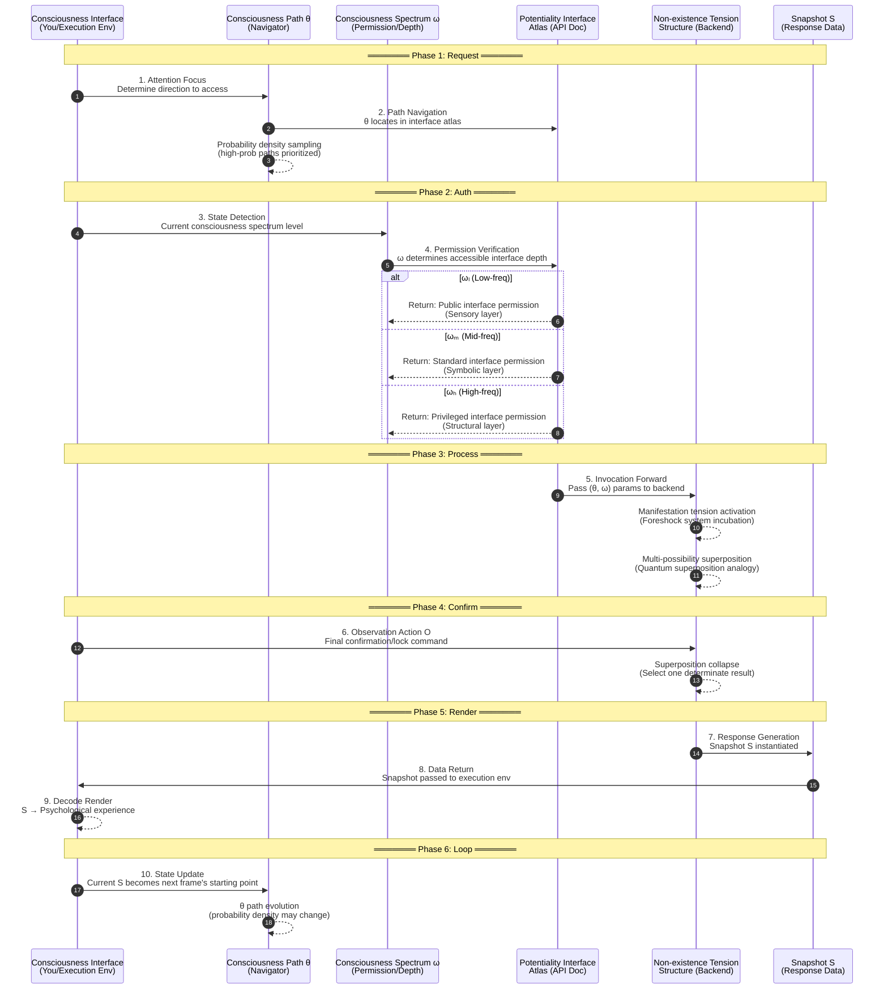

# System Overview | System Overview

[](../zh/system-overview.md)

> This document integrates the work introduction and Chapter 8 integrative review from v3 manuscript, providing the macroscopic logic flow of MVM model.

---

## Work Introduction

**"Meta-Void Model: A Non-Existence Cosmology from the Consciousness Dimension"—— A Thought Expedition to Reconstruct Reality and Self**

We live in a "reality" that appears stable, orderly, and independent of our existence. Sunlight shuttles through window lattices, time flows like a river, matter constitutes a world within reach. We are accustomed to believing the universe is a magnificent script already written, science's task is to decode it, and we are observers or actors upon the stage. But could all this be merely our most deeply rooted illusion? What if "reality" is not a pre-existing objective entity awaiting our discovery, but rather—**manifestation patterns generated frame by frame through your participation, in specific manner, right here?**

"Meta-Void Model" unfolds precisely from this subversive inquiry, embarking on a profound, systematic, and challenging thought experiment. It does not intend to negate modern science's brilliant achievements—whether quantum mechanics' precise equations or neuroscience's detailed depiction of the brain—but stands on these achievements' shoulders, courageously gazing at those profound cracks emerging at science's own boundaries: Why do microscopic particles' states seem to depend on "observation" to become determinate? Why cannot brain's physical activity completely explain the generation of subjective "experience" (the hard problem of consciousness)? Why is the universe's origin and structure filled with inexplicable "coincidences" and parameters?

This book boldly proposes that these cracks may point to a common source: we may have fundamentally misunderstood the universe's foundational structure, and consciousness's role within it. Traditional conception views consciousness as byproduct of matter's complexification, "software" or "phantom" of the biological computer called brain. "Meta-Void Model" reverses this, viewing **consciousness as an indispensable structural dimension of the universe itself**, as fundamental as space and time. It is no longer your private possession within your head, but more like a universe-pervading "consciousness network" with different levels (spectrum ω) and access paths (path θ). You are not consciousness's owner, but a dynamic intersection point within this network, a "manifestation interface" through which universe observes itself.

Based on this, the book's core thesis is: **Universe is not an "existing" entity "constituted" by "particles," but a potentiality structure of "Non-existence" (termed "Non-existence tension").** This "Non-existence" is not void, but the "pre-manifestation" state before universe is "illuminated" by consciousness, containing all possibilities, filled with structural tension—like an unloaded game map or unplucked string. Reality's generation is not material evolution, but occurrence of "manifestation events" one after another.

To describe this mechanism, the book constructs the "Five-Dimensional Snapshot Model" (S := S(x,y,z | t | ω, O, θ)). This model holds that each "now" you experience is not a point in time's long river, but a discrete "reality rendering" defined jointly by spatial coordinates (x,y,z), time parameter (t), your consciousness spectrum state (ω), observation action (O), and the specific consciousness path (θ) through which you access potentiality structure. Just as film comprises frame-by-frame images, reality is also a sequence of snapshots continuously "triggered" and "rendered" by consciousness within Non-existence tension field. Your perceived "flow sensation" is largely the result of consciousness system's efficient "stitching" of these discrete snapshots.

In this model:

**Particles** are no longer universe's "bricks," but projection "pixels" produced when Non-existence tension is activated along specific consciousness path.

**Time** is no longer unidirectionally flowing river, but a parameter dimension within snapshot generation sequence that can be non-linearly accessed, explaining phenomena like memory (re-manifestation of old snapshots), premonition (tension perturbation from future snapshots), inspiration (cross-structural connection of snapshots), and epiphany (collapse integration of snapshot chain).

**"You"** (self) is no longer a fixed subject possessing consciousness, but the "continuity illusion" presented by a series of dynamically generated snapshot chains formed when cosmic consciousness takes specific path (θ) and spectrum (ω) at your node.

This book will systematically elaborate these core concepts, starting from deconstructing "particle constitution view," gradually introducing consciousness's dimensional structure, snapshot generation mechanism, Non-existence tension's characteristics, and finally proposing a new cosmic picture based on "Mapping Theory" (Universe = Consciousness Path × Potentiality Interface Atlas). It will even redefine "life"—no longer limited to carbon-based organisms, but measuring system's "capacity to continuously generate reality snapshots."

**Important Declaration:**

"Meta-Void Model" is a serious theoretical exploration work, aiming to stimulate rational thinking and open discussion. The author is deeply aware that themes discussed in the book may connect with or be compared to concepts of certain religions, mysticism, or philosophical schools. **The author hereby solemnly declares that this book does not intend to support or verify any specific religious dogma, mystical experience, or supernatural claims. Concepts in the book are part of the theoretical model and should be understood within its own logical framework. Meanwhile, the author explicitly opposes any behavior of quoting out of context, distorting and utilizing this book's viewpoints to serve pseudoscientific propaganda or other irrational claims.** The book's value lies in proposing one possible structural explanation, not providing a set of ultimate answers requiring faith.

We sincerely invite you, with open mind and critical thinking, to embark together on this thought journey exploring the essence of universe and consciousness. This may not be an easy path; it will challenge your most accustomed cognition about reality, self, and existence itself. But as the book reveals: **You are not merely living in this universe; in certain sense, it is through you that universe manifests as itself.** Ready to re-recognize your relationship with the world?

---

## Model's Integrative Review: Five-Dimensional Snapshot × Non-Existence Tension × Mapping Path

### I. Revisiting Core Components: The Model's Four Pillars

In "Meta-Void Model's" layer-by-layer construction, we gradually introduced and elucidated several core conceptual components. Now, to grasp the model's overall picture, it is necessary to replace them under spotlight, emphasizing their inseparable organic connections. The entire model can be understood as built upon four pillars:

#### Pillar One: Non-Existence Tension Structure (The Ground)

> Non-existent Tension Structure / Potential Interface Atlas

**Reviewing its essence:** This is the universe's **ontological cornerstone**, the ultimate **"raw material" or "potentiality soil"** enabling all reality manifestation. We repeatedly emphasize it is **not void**, but a potentiality field filled with **internal structure**. It possesses:

- **Potentiality:** Contains all possible reality patterns, rules, and information, in a state of "not yet defined" or "not yet activated."
- **Structurality:** Not chaotic, but possessing internal organizational principles, possibly manifesting as information structure, mathematical structure, or relational network. We term it "Potentiality Interface Atlas," emphasizing its functional interface characteristics oriented toward invocation.
- **Dynamic Responsiveness:** Capable of responding to consciousness's "touch," forming perturbation echoes of "manifestation tension."
- **Non-homogeneity:** May possess different "structural densities," affecting different regions' potential and complexity for generating reality.

**Role in Model:** It provides **all possible content and structural constraints** needed for reality generation. Without this potentiality soil, all generation is impossible. It is universe's "backend database" and "rules engine."

→ See [core/meta-void/](../core/meta-void/tension-structure.md)

#### Pillar Two: Five-Dimensional Snapshot Generation Mechanism (The Engine)

> 5D Snapshot Generation Mechanism

**Reviewing its mechanism:** This is the core **"production line" or "engine"** connecting potentiality and manifestation. It reveals reality is not continuously flowing, but generated frame-by-frame in **discrete "five-dimensional snapshots" S := S(x,y,z | t | ω, θ, O)** as basic units.

- **Discreteness:** Breaks the illusion of temporal continuity, understanding reality as a series of independent generation events.
- **Multi-dimensional Determination:** Snapshot generation is not determined by single factor, but **jointly defined and triggered** by five dimensional parameters: **spatiotemporal coordinates (x,y,z,t)** (localization), **consciousness spectrum ω** (controlling depth/quality), **consciousness path θ** (selecting content/form), and **observation action O** (confirmation lock).

**Role in Model:** It describes **how the specific transformation process** from potentiality to reality occurs, the **direct operational mechanism** through which reality "manifests." It connects ontological foundation (Non-existence tension) and phenomenological experience (reality we experience).

→ See [engine/snapshot-service/](../engine/snapshot-service/discrete-generation.md)

#### Pillar Three: Consciousness Dimension and Parameters (The Controller)

> Consciousness Dimension & Parameters - ω, θ, O

**Reviewing its status:** Consciousness in the model is no longer matter's byproduct or bystander, but elevated to **universe's structural dimension**, an **indispensable core driving and controlling force** in reality generation process. This force manifests through specific consciousness parameters:

- **Consciousness Spectrum ω:** As "depth/quality modulator," determines the accessed potentiality level and manifestation resolution.
- **Consciousness Path θ:** As "content/form selector and navigator," determines which potentiality interfaces to invoke and how to couple, with selection following certain probability density.
- **Observation Action O:** As "final confirmation and lock trigger," completes the final leap from indeterminate foreshock to determinate snapshot.

**Role in Model:** Consciousness parameters constitute the snapshot generation engine's "operational commands and controller." They are the key bridge connecting consciousness subject (as interface) with cosmic potentiality structure, endowing reality generation with **selectivity, directionality, and plasticity**.

→ See [core/consciousness/](../core/consciousness/spectrum-omega.md)

#### Pillar Four: Mapping Theory (The Logic)

> Mapping Theory

**Reviewing its paradigm:** This is the new paradigm providing **ontological explanatory framework and operational logic** for the entire model. It replaces traditional "Compositionism," asserting that reality generation is the process of **consciousness path "invoking" and "mapping" potentiality interface atlas**, not combination of material "building blocks."

- **Invocation not Construction:** Emphasizes information interaction and functional realization over material stacking.
- **Interface not Entity:** Shifts focus from seeking elementary particles to understanding potentiality structure's interaction interface.
- **Execution Environment:** Repositions "you" (consciousness node) as the key "execution environment" where manifestation occurs.

**Role in Model:** Mapping Theory describes the **"underlying operational logic" or "protocol"** by which snapshot generation engine interacts with potentiality raw material under consciousness controller's operation.

→ See [engine/mapping-logic/](../engine/mapping-logic/api-mapping.md)

---

### II. Single-Frame Snapshot Lifecycle: Precise Sequence Diagram

The following diagram shows the complete lifecycle of **one reality frame (Snapshot S)** from request to rendering:



**Sequence Explanation:**

| Phase | Steps | Key Actions | Corresponding Concepts |
|-------|-------|-------------|----------------------|
| **Request** | 1-2 | θ determines interface to invoke | Consciousness path navigation |
| **Auth** | 3-4 | ω verifies accessible depth | Permission/Spectrum level |
| **Process** | 5 | Backend processing, foreshock incubation | Manifestation tension activation |
| **Confirm** | 6 | O executes, superposition collapses | Observation action confirmation |
| **Render** | 7-9 | S returned and rendered as experience | Snapshot manifestation |
| **Loop** | 10 | Current frame becomes next frame's starting point | Snapshot chain continuation |

---

### III. Integrated Model Logic Flow: Complete Path from Potentiality to Manifestation

```
┌─────────────────────────────────────────────────────────────────────────┐
│                     MVM Generation Logic Flow Diagram                   │
├─────────────────────────────────────────────────────────────────────────┤
│                                                                         │
│   ┌─────────────┐                                                       │
│   │ Non-existence│  ← Raw material ready (Potentiality Interface Atlas) │
│   │ Tension      │                                                       │
│   │ Structure(ρₛ)│                                                       │
│   └──────┬──────┘                                                       │
│          │                                                              │
│          ▼                                                              │
│   ┌─────────────┐                                                       │
│   │ Consciousness│  ← Controller ready (ω Spectrum + θ Path)            │
│   │ Involvement  │                                                       │
│   │ (ω, θ)      │                                                       │
│   └──────┬──────┘                                                       │
│          │                                                              │
│          ▼                                                              │
│   ┌─────────────┐                                                       │
│   │ Touch &     │  ← Production line warm-up                            │
│   │ Incubation  │     (Manifestation tension + Foreshock state)         │
│   │ (Manifest.  │                                                       │
│   │  Tension)   │                                                       │
│   └──────┬──────┘                                                       │
│          │                                                              │
│          ▼                                                              │
│   ┌─────────────┐                                                       │
│   │ Invocation &│  ← API invocation                                     │
│   │ Mapping     │     (θ selects interface + ω sets permission)         │
│   │ (Mapping)   │                                                       │
│   └──────┬──────┘                                                       │
│          │                                                              │
│          ▼                                                              │
│   ┌─────────────┐                                                       │
│   │ Confirm &   │  ← Trigger execution                                  │
│   │ Generate    │     (O locks → Snapshot S generated)                  │
│   │ (O → S)     │                                                       │
│   └──────┬──────┘                                                       │
│          │                                                              │
│          ▼                                                              │
│   ┌─────────────┐                                                       │
│   │ Experience  │  ← User interface rendering                           │
│   │ Presentation│     (Subjective experience)                           │
│   │ (Experience)│                                                       │
│   └──────┬──────┘                                                       │
│          │                                                              │
│          └──────────────────┐                                           │
│                             ▼                                           │
│                      ┌─────────────┐                                    │
│                      │ Cyclic      │  ← Feedback drives next frame      │
│                      │ Repetition  │                                    │
│                      │ (Feedback)  │                                    │
│                      └─────────────┘                                    │
│                                                                         │
└─────────────────────────────────────────────────────────────────────────┘
```

**Complete Logic Flow Description:**

1. **Foundation is Potentiality:** Universe's ontological cornerstone is **Non-existence tension structure (Potentiality Interface Atlas)**, containing all possible reality patterns and generation rules, possessing different structural densities and response characteristics. **(Raw material ready)**

2. **Consciousness Involvement is Key:** **Consciousness (as structural dimension) contacts this potentiality field through its interface (e.g., body/brain). Consciousness's state is characterized by spectrum ω**, its directionality and selection tendency navigated by **path θ** (following probability density). **(Controller and commands ready)**

3. **Touch and Incubation:** Consciousness path θ's approach or focus **"touches" specific regions (interfaces) of Non-existence tension structure, triggering** perturbation echoes of manifestation tension. Sustained touch and higher ω state may cause structure to enter unstable "foreshock" state. **(Production line warm-up, raw material selected and processing begins)**

4. **Invocation and Mapping:** Under Mapping Theory's logic, this touch and incubation process is understood as one (or series of) **API invocations**. θ selected interface and provided parameters, ω set permission and quality requirements. **(Operational commands issued, invocation protocol activated)**

5. **Confirmation and Generation:** Finally, an **observation action O** (whether external measurement or internal confirmation) acts as **trigger**, guided by ω and θ, **locks** one specific result within the "foreshock" state, completes the potentiality interface invocation, "maps" potentiality structure into one determinate **reality snapshot S**, and "instantiates" it at specific spatiotemporal coordinates (x,y,z,t). **(Production command confirmed, product comes off line)**

6. **Experience Presentation:** This generated snapshot S is **"decoded" and "rendered" within consciousness interface's "execution environment"**, finally presenting as **subjective experience** of that moment's reality content and feeling. **(Product finally displays on user interface)**

7. **Cyclic Repetition:** This frame's snapshot generation becomes consciousness path θ's **new starting point and environment** (feedback) for next moment's selection and evolution, driving next frame's snapshot generation. Reality's stream is thus frame-by-frame, **cyclically repeating, dynamically generated** in continuous consciousness-potentiality interaction.

---

### IV. Model's Integrated Explanatory Power: Responding to Fundamental Difficulties

Integrating these four pillars, "Meta-Void Model's" value lies not only in theoretical self-consistency, but in providing **unified, alternative explanatory perspective** for a series of fundamental difficulties troubling science and philosophy:

| Difficulty | MVM Explanation |
|------------|-----------------|
| **Quantum Measurement Problem** | Consciousness (θ, ω, O) **participates in** the **generation process** itself from potentiality (superposition) to reality (collapsed state/snapshot S). Observation is part of generation. |
| **Quantum Entanglement/Non-locality** | Originates from Non-existence tension structure/interface atlas's own **holistic correlation**. Invoking one interface may non-locally affect other interfaces' states associated with it. |
| **Hard Problem of Consciousness (Qualia)** | Subjective experience is **the intrinsic phenomenological aspect necessarily accompanying reality snapshot S's "rendering" in consciousness interface**. |
| **Essence of Time** | Time is embodiment of **snapshot sequence generation's internal rhythm**, driven by θ path updates. |
| **Definition of Life** | Life's essence is **"manifestation capacity" to continuously generate reality snapshots**. |
| **Fine-Tuning Problem** | Physical constants are **stable macroscopic parameters emergent from cosmic integral consciousness (Θ) and potentiality structure (ρₛ)'s long-term interactive evolution**. |

---

## Related Links

- [Paradigm Shift →](paradigm-shift.md)
- [Design Principles →](design-principles.md)
- [Core Mechanism →](../core/meta-void/tension-structure.md)
- [Rendering Engine →](../engine/snapshot-service/discrete-generation.md)
- [Glossary →](../assets/glossary.md)

