# API Mapping | 映射论与调用逻辑

> **模块职责**：阐述 MVM 的核心本体论范式——映射论，用 API 类比解释现实生成机制  
> **依赖模块**：`engine/mapping-logic/formula-S.md`, `core/meta-void/*`  
> **被依赖于**：`engine/mapping-logic/integral-model.md`, `modules/life-definition.md`

---

## 📋 Executive Summary

```
┌─────────────────────────────────────────────────────────────────────────┐
│                  映射论核心范式 (Mapping Theory)                         │
├─────────────────────────────────────────────────────────────────────────┤
│                                                                         │
│  ╔═══════════════════════════════════════════════════════════════════╗ │
│  ║                                                                   ║ │
│  ║   宇宙显现 ≈ 意识路径(θ) × 潜能接口图谱                            ║ │
│  ║                                                                   ║ │
│  ╚═══════════════════════════════════════════════════════════════════╝ │
│                                                                         │
│  范式对比:                                                              │
│    ❌ 构成论: 宇宙 = Σ 物质积木  (搭建而成)                             │
│    ✅ 映射论: 宇宙 = 调用(θ, ω, O) → 潜能接口  (映射而显)               │
│                                                                         │
│  核心主张:                                                              │
│    现实不是"构成"的，而是"调用"的                                        │
│    粒子不是"砖块"，而是"像素"                                           │
│    你不是"观察者"，而是"执行环境"                                        │
│                                                                         │
└─────────────────────────────────────────────────────────────────────────┘
```

---

## 1. 核心公理 (Mapping Axioms)

### Axiom M.1 — 调用优先原理

```
┌─────────────────────────────────────────────────────────────────────────┐
│  AXIOM M.1  Invocation Priority Principle                              │
│                                                                         │
│  现实的显现源于"调用" (Invocation)，而非"构成" (Composition)。           │
│                                                                         │
│  传统: Reality = assemble(particles)     // 粒子组装                   │
│  MVM:  Reality = invoke(θ, ω, O) → API   // 接口调用                   │
│                                                                         │
│  推论: 没有调用，就没有显现                                              │
│                                                                         │
└─────────────────────────────────────────────────────────────────────────┘
```

### Axiom M.2 — 接口图谱原理

```
┌─────────────────────────────────────────────────────────────────────────┐
│  AXIOM M.2  Interface Atlas Principle                                  │
│                                                                         │
│  非存在张力结构的功能性表述是"潜能接口图谱"——                             │
│  一个定义了所有可能显现模式和规则的结构化目录。                            │
│                                                                         │
│  特性:                                                                  │
│    - 多层级: 从基础接口到复杂接口                                        │
│    - 相互关联: 接口之间有依赖和调用关系                                   │
│    - 可能动态: 图谱本身可能随宇宙演化而变化                               │
│                                                                         │
│  类比: 宇宙的"API文档" + "后端服务"                                      │
│                                                                         │
└─────────────────────────────────────────────────────────────────────────┘
```

### Axiom M.3 — 执行环境原理

```
┌─────────────────────────────────────────────────────────────────────────┐
│  AXIOM M.3  Execution Environment Principle                            │
│                                                                         │
│  你（意识节点）是现实得以显现的"执行环境"——                               │
│  API 调用发生的场所，响应被解码渲染的终端。                               │
│                                                                         │
│  你的角色:                                                              │
│    ❌ 创造者: 你不能编写新的接口规则                                     │
│    ❌ 自主调用者: 你的调用受概率密度约束                                  │
│    ✅ 执行环境: 你是调用发生、响应渲染的必要场所                          │
│                                                                         │
│  推论: 你不是"拥有"意识，你"是"意识显现的接口                             │
│                                                                         │
└─────────────────────────────────────────────────────────────────────────┘
```

---

## 2. 范式对比矩阵

### 2.1 构成论 vs 映射论

| 维度 | 构成论 (Compositionism) | 映射论 (Mapping Theory) |
|------|------------------------|------------------------|
| **宇宙本质** | 物质积木的堆砌 | 潜能接口的调用 |
| **基本单元** | 粒子 (砖块) | 快照 (像素) |
| **生成方式** | 组合 → 整体 | 调用 → 显现 |
| **因果机制** | 物质相互作用 | 调用-响应链 |
| **时空** | 容器 (背景) | 坐标 (锚点参数) |
| **意识** | 副产品 (涌现) | 核心驱动 (调用者) |
| **你** | 观察者/旁观者 | 执行环境/接口 |
| **规律来源** | 物理定律 (先验) | 接口稳定性 (结构) |
| **认知方式** | 被动反映 | 主动调用 |

### 2.2 为何映射论更优

| 挑战 | 构成论的困境 | 映射论的解释 |
|------|-------------|-------------|
| **量子叠加** | 粒子如何同时是多种状态？ | 接口在调用前处于多响应模式叠加 |
| **测量塌缩** | 为何观察改变现实？ | O 触发选择一种映射方式 |
| **量子纠缠** | 超距作用如何可能？ | 接口图谱是非局域关联的网络 |
| **意识硬问题** | 物质如何产生体验？ | 意识是调用者，非被调用者 |
| **时间箭头** | 时间为何单向？ | 快照链的序号是导航坐标，非流向 |

---

## 3. API 类比详解

### 3.1 核心映射表

```
┌─────────────────────────────────────────────────────────────────────────┐
│                    MVM ↔ API 概念映射表                                  │
├─────────────────────────────────────────────────────────────────────────┤
│                                                                         │
│  MVM 概念                    API 类比                  功能              │
│  ─────────────────────────────────────────────────────────────────────  │
│  非存在张力结构              后端服务器/云平台          存储所有潜能        │
│  潜能接口图谱                API 文档/端点列表          定义可调用的接口    │
│  意识路径 θ                  API 请求/调用序列          选择要访问的资源    │
│  意识频谱 ω                  权限密钥/访问级别          决定可访问的深度    │
│  观察行为 O                  发送请求/执行命令          触发数据返回        │
│  现实快照 S                  API 响应数据              实际显现的内容      │
│  意识接口 (你)               客户端/执行环境            解析和渲染响应      │
│                                                                         │
└─────────────────────────────────────────────────────────────────────────┘
```

### 3.2 调用流程图 (简化版)

```mermaid
sequenceDiagram
    participant You as 意识接口 (你)
    participant Theta as 路径选择 θ
    participant Omega as 频谱设定 ω
    participant Atlas as 潜能接口图谱
    participant Backend as 非存在张力结构
    participant S as 现实快照

    You->>Theta: 注意力焦点
    You->>Omega: 意识状态
    Theta->>Atlas: 选择要调用的接口
    Omega->>Atlas: 设定权限级别
    You->>Atlas: O: 发送请求
    Atlas->>Backend: 查询潜能
    Backend-->>Atlas: 返回潜能数据
    Atlas-->>S: 映射为快照
    S-->>You: 渲染为心理体验
```



> 📌 **完整时序图**（含 6 个阶段、10 个步骤）请参阅 → [spec/system-overview.md](../../spec/system-overview.md#二-单帧快照生命周期精确时序图)

### 3.3 权限级别类比 (ω)

```
ω 作为"API 权限密钥":

┌─────────────────────────────────────────────────────────────────────────┐
│  权限级别      可访问接口                返回数据                         │
├─────────────────────────────────────────────────────────────────────────┤
│  ωₗ (低频)    公开接口                  摘要/低分辨率                     │
│               物理/生理层现实           感官直接呈现                      │
│               示例: /basic/sensory      {"color": "red"}                │
├─────────────────────────────────────────────────────────────────────────┤
│  ωₘ (中频)    标准接口                  完整数据                         │
│               符号/社会层现实           概念/逻辑结构                     │
│               示例: /standard/cognitive  {"concept": "...", "logic":...} │
├─────────────────────────────────────────────────────────────────────────┤
│  ωₕ (高频)    特权/内部接口             完整+元数据                       │
│               结构/本源层现实           深层模式/整体洞见                 │
│               示例: /internal/structure  {"pattern": ..., "meta": ...}  │
└─────────────────────────────────────────────────────────────────────────┘
```

---

## 4. "你"的角色重定位

### 4.1 角色对比

| 传统定位 | 映射论定位 | 区别 |
|----------|-----------|------|
| **创造者** | **接口** | 你不能编写规则，但你是规则执行的场所 |
| **观察者** | **执行环境** | 你不是在"看"现实，而是现实在你这里"发生" |
| **拥有者** | **通道** | 你不"拥有"意识，意识通过你"显现" |
| **主体** | **焦点** | 你不是世界的中心，而是宇宙显现的一个焦点 |

### 4.2 执行环境三层含义

```
你作为"执行环境"的三层含义:

┌─────────────────────────────────────────────────────────────────────────┐
│  Layer 1: 你是"接口"本身                                                │
├─────────────────────────────────────────────────────────────────────────┤
│  你的身体/大脑是意识与潜能交互的物理锚点                                   │
│  你是信息转换的枢纽: 潜能响应 → 心理体验                                  │
│  你的存在就是这个接口的存在                                              │
└─────────────────────────────────────────────────────────────────────────┘
                                    │
                                    ▼
┌─────────────────────────────────────────────────────────────────────────┐
│  Layer 2: 你是"执行场所"                                                │
├─────────────────────────────────────────────────────────────────────────┤
│  快照生成必须在一个具体的"场所"中完成                                     │
│  你是调用-响应-显现流程得以闭环的必要条件                                 │
│  没有执行环境，就没有"现实感"                                            │
└─────────────────────────────────────────────────────────────────────────┘
                                    │
                                    ▼
┌─────────────────────────────────────────────────────────────────────────┐
│  Layer 3: 你是"独特的"执行环境                                          │
├─────────────────────────────────────────────────────────────────────────┤
│  每个意识接口都是独一无二的                                              │
│  你的结构、历史、ω、θ 共同构成独特的"运行配置"                            │
│  同样的调用，在不同的环境中会产生不同的渲染结果                            │
└─────────────────────────────────────────────────────────────────────────┘
```

---

## 5. 映射论的哲学意涵

### 5.1 本体论重构

| 传统本体论 | 映射论本体论 |
|-----------|-------------|
| 存在 = 物质实体的属性 | 存在 = 显现的发生 |
| 实在 = 独立于观察的事物 | 实在 = 调用与响应的关系 |
| 真理 = 命题与事实的符合 | 真理 = 接口规则的一致性 |
| 因果 = 物质间的传递 | 因果 = 调用链的结构耦合 |

### 5.2 认识论重构

```
认识的新理解:

  传统: 认识 = 被动反映 (镜子)
        意识 → 感知 → 外部现实
        
  映射论: 认识 = 主动调用 (API客户端)
          意识 → 调用(θ,ω,O) → 潜能接口 → 响应 → 解码
          
  关键区别:
    - 你能认识什么，取决于你能调用什么
    - 调用范围受 θ 路径和 ω 权限制约
    - 认识本身就是一种生成性的交互行为
```

### 5.3 核心洞见

> **"你不是在建构宇宙，而是宇宙以你而显现。"**

```
传统: 你 ─── 认识/观察 ───▶ 外部宇宙 (预先存在)

映射论:
  
     ┌───────────────────────────────────────────────┐
     │                   潜能接口图谱                  │
     │               (非存在张力结构)                  │
     └───────────────────┬───────────────────────────┘
                         │
                    调用 (θ, ω, O)
                         │
                         ▼
               ┌─────────────────┐
               │   你 (执行环境)  │
               │                 │
               │  ← 渲染/显现 ←  │
               └─────────────────┘
                         │
                         ▼
                   现实快照 S
                   (你的体验)

关键: 宇宙不是"在那里"等着你去看
      宇宙是"通过你"才得以显现
```

---

## 6. 核心洞见总结

> **Insight A.1** (Invocation, Not Construction)  
> 现实是"调用"的结果，不是"搭建"的产物。没有调用，就没有显现。

> **Insight A.2** (Interface, Not Entity)  
> 宇宙的基础是潜能接口图谱，不是物质实体。理解宇宙 = 理解接口规则。

> **Insight A.3** (Environment, Not Observer)  
> 你是现实显现的"执行环境"，不是站在外面的"观察者"。现实在你这里发生。

> **Insight A.4** (Symbiosis, Not Separation)  
> 你与宇宙是交互共生的关系，不是主客分离的对立。你是宇宙自我显现的焦点。

---

## 7. 导航索引

### 从本文档出发

| 如果你想了解... | 前往 |
|-----------------|------|
| 核心生成公式 S | [→ formula-S.md](formula-S.md) |
| 宇宙积分模型 | [→ integral-model.md](integral-model.md) |
| 潜能场结构 | [→ ../../core/meta-void/potentiality-field.md](../../core/meta-void/potentiality-field.md) |
| 张力结构 | [→ ../../core/meta-void/tension-structure.md](../../core/meta-void/tension-structure.md) |
| 意识路径 θ | [→ ../../core/consciousness/path-theta.md](../../core/consciousness/path-theta.md) |
| 意识频谱 ω | [→ ../../core/consciousness/spectrum-omega.md](../../core/consciousness/spectrum-omega.md) |

### 术语速查

- **映射论** → [glossary](../../assets/glossary.md#mapping-theory)
- **潜能接口图谱** → [glossary](../../assets/glossary.md#potential-interface-atlas)
- **执行环境** → [glossary](../../assets/glossary.md#execution-environment)

---

<div align="center">

*"你不是在用积木搭建世界，世界是通过你这个棱镜折射出它的光彩。"*

</div>
