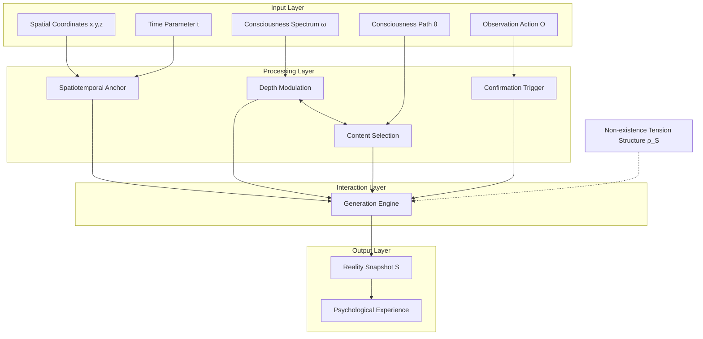

# Formula S | Core Generation Formula

[](formula-S.md)

> **Module Responsibility**: Define MVM's core generation formula, unifying all consciousness parameters and potentiality mapping  
> **Dependencies**: `core/meta-void/*`, `core/consciousness/*`, `engine/snapshot-service/*`  
> **Depended By**: Theoretical foundation for all modules

---

## 📋 Executive Summary

```
┌─────────────────────────────────────────────────────────────────────────┐
│           MVM Core Generation Engine Formula                            │
├─────────────────────────────────────────────────────────────────────────┤
│                                                                         │
│            ╔═════════════════════════════════════════════════╗         │
│            ║                                                 ║         │
│            ║       S := S(x, y, z | t | ω, θ, O)            ║         │
│            ║                                                 ║         │
│            ╚═════════════════════════════════════════════════╝         │
│                                                                         │
│  Structural Decomposition:                                              │
│                                                                         │
│    [Space-Time Layer]    (x, y, z, t)  →  Localization Anchor:         │
│                                           "where/when"                  │
│    [Spectrum Control]    (ω)           →  Depth Modulation:            │
│                                           "with what state/resolution"  │
│    [Path Selection]      (θ)           →  Content Selection:           │
│                                           "manifest what/connect what"  │
│    [Confirmation Lock]   (O)           →  Trigger Generation:          │
│                                           "execution confirm/state fix" │
│                                                                         │
│  Essential Position:                                                    │
│    This is not "descriptive formula" but "generative grammar"          │
│    It defines "how reality is created," not "what reality is"          │
│                                                                         │
└─────────────────────────────────────────────────────────────────────────┘
```

---

## 1. Core Axioms (Formula Axioms)

### Axiom F.1 — Generative Grammar Principle

```
┌─────────────────────────────────────────────────────────────────────────┐
│  AXIOM F.1  Generative Grammar Principle                               │
│                                                                         │
│  Snapshot formula S := S(x,y,z|t|ω,θ,O) is not a description of        │
│  reality state, but the "grammatical rules" by which reality           │
│  is generated.                                                          │
│                                                                         │
│  Analogy:                                                              │
│    As language grammar specifies which sentences are valid,             │
│    snapshot formula specifies which parameter combinations can          │
│    validly generate effective reality snapshots.                        │
│                                                                         │
│  Corollary: Universe is not preset movie but real-time rendered        │
│             interactive experience                                      │
│                                                                         │
└─────────────────────────────────────────────────────────────────────────┘
```

### Axiom F.2 — Parameter Synergy Principle

```
┌─────────────────────────────────────────────────────────────────────────┐
│  AXIOM F.2  Parameter Synergy Principle                                │
│                                                                         │
│  Formula parameters operate not independently but in dynamic           │
│  synergistic equilibrium.                                               │
│                                                                         │
│  Synergistic Relations:                                                │
│    ω ⟷ θ : ω modulates θ's selection range; θ influences ω's state    │
│    (ω,θ) → O : O execution requires ω and θ to reach synergy threshold │
│    O → S : After O confirmation, S collapses from superposition to     │
│            determinate state                                            │
│                                                                         │
│  Result: Each frame of reality is product of all parameters'           │
│          synergistic operation                                          │
│                                                                         │
└─────────────────────────────────────────────────────────────────────────┘
```

### Axiom F.3 — Potentiality Mapping Principle

```
┌─────────────────────────────────────────────────────────────────────────┐
│  AXIOM F.3  Potentiality Mapping Principle                             │
│                                                                         │
│  Formula directly operates upon "Non-existence tension structure,"     │
│  mapping reality snapshots from it.                                     │
│                                                                         │
│  Operation Mechanism:                                                   │
│    θ → Touches potentiality soil, triggers manifestation tension       │
│    ω → Influences activation threshold, determines response depth      │
│    O → Completes solidification on foreshock-prepared soil             │
│    S → Determinate snapshot "crystallized" from potentiality structure │
│                                                                         │
│  Corollary: Formula is the "operational protocol" for consciousness-   │
│             potentiality interaction                                    │
│                                                                         │
└─────────────────────────────────────────────────────────────────────────┘
```

---

## 2. Parameter Role Matrix

### 2.1 Structured Parameter Table

| Parameter | Role | Function | Metaphor | Scope of Influence | Detailed Definition |
|-----------|------|----------|----------|-------------------|---------------------|
| **(x,y,z,t)** | Coordinate Locator | Provides generation "anchor" and "instantiation framework" | GPS/Rendering Coordinate System | Snapshot's spatiotemporal position | [→ discrete-generation](../snapshot-service/discrete-generation.en.md) |
| **[ω](../../core/consciousness/spectrum-omega.md)** | Depth Modulator | Modulates information depth, structural layer, resolution | Microscope Magnification/VR Adjustment | "Texture" of manifestation | [→ spectrum-omega](../../core/consciousness/spectrum-omega.md) |
| **[θ](../../core/consciousness/path-theta.md)** | Content Navigator | Selects which potentiality interfaces to invoke, shapes snapshot form | Search Engine/API Call | "Content" of manifestation | [→ path-theta](../../core/consciousness/path-theta.md) |
| **O** | Confirmation Trigger | Executes final confirmation, collapses superposition to determinate state | Shutter/Submit Button | "Occurrence" of manifestation | [→ api-mapping](api-mapping.en.md) |

### 2.2 Parameter Interaction Diagram



---

## 3. Generation Scenario Examples

### 3.1 Scenario Comparison Table

| Scenario | (x,y,z,t) | ω | θ | O | Generated S |
|----------|-----------|---|---|---|-------------|
| **Tasting Apple** | Your position with apple, this moment | ωₗ (sensory layer) | Focus on taste, texture, aroma | Action of tasting | Sensory-dominant experience snapshot |
| **Recalling Childhood** | Now, but θ traces back to t_past | ωₘ (memory layer) | Invoke potentiality of childhood scene | Trigger point (scent/sound) | Memory snapshot |
| **Solving Math Problem** | At desk, this moment | ωₘ↔ωₕ fluctuation | Exploring among mathematical concepts | "Aha!" moment | Insight snapshot |
| **Deep Meditation** | Body position, this moment | ωₕ (insight layer) | θ relaxed, deep coupling | Sustained abiding | Structural/source layer snapshot |

### 3.2 Generation Flow Diagram

```
Generation Flow (Each Frame):

  ┌──────────────┐
  │ Consciousness │
  │ Interface     │
  │ (You)         │
  └──────┬───────┘
         │
         ▼
  ┌──────────────────────────────────────────────────────────────┐
  │  Step 1: Localization                                        │
  │  (x,y,z,t) determines generation's spatiotemporal anchor     │
  └──────────────────────────┬───────────────────────────────────┘
                             │
                             ▼
  ┌──────────────────────────────────────────────────────────────┐
  │  Step 2: Frequency Tuning                                    │
  │  ω sets current consciousness state, determines accessible   │
  │  potentiality depth                                          │
  └──────────────────────────┬───────────────────────────────────┘
                             │
                             ▼
  ┌──────────────────────────────────────────────────────────────┐
  │  Step 3: Selection                                           │
  │  θ navigates potentiality interface atlas, selects           │
  │  interfaces to invoke                                        │
  └──────────────────────────┬───────────────────────────────────┘
                             │
                             ▼
  ┌──────────────────────────────────────────────────────────────┐
  │  Step 4: Incubation (Foreshock)                             │
  │  Manifestation tension accumulates, multiple possibilities   │
  │  superpose                                                   │
  └──────────────────────────┬───────────────────────────────────┘
                             │
                             ▼
  ┌──────────────────────────────────────────────────────────────┐
  │  Step 5: Confirmation                                        │
  │  O executes, superposition collapses, snapshot S             │
  │  generated and locked                                        │
  └──────────────────────────┬───────────────────────────────────┘
                             │
                             ▼
  ┌──────────────────────────────────────────────────────────────┐
  │  Step 6: Rendering                                           │
  │  S decoded as psychological experience in consciousness      │
  │  interface                                                   │
  └──────────────────────────────────────────────────────────────┘
```

---

## 4. Cosmic Integral Model (Conceptual Extension)

### 4.1 From Microscopic to Macroscopic

```
┌─────────────────────────────────────────────────────────────────────────┐
│                Cosmic Integral Model                                    │
├─────────────────────────────────────────────────────────────────────────┤
│                                                                         │
│  Core Idea:                                                            │
│    Macroscopic Reality R ≠ Preset existence                            │
│    Macroscopic Reality R = Integrated superposition effect of          │
│                            countless microscopic snapshots S            │
│                                                                         │
│  Conceptual Formula:                                                    │
│                                                                         │
│    Reality(t) = ∫∫∫ S(x,y,z|t|ω,θ,O) · ρₛ(x,y,z) dV                   │
│                                                                         │
│    Where:                                                               │
│      ρₛ = Local snapshot density (generation intensity/complexity)     │
│      dV = Infinitesimal structural volume                              │
│      Integration Range = Potentiality space accessible to consciousness│
│                                                                         │
│  Explanation:                                                           │
│    Universe Totality = Σ All snapshot generation events of all         │
│                        consciousness nodes                              │
│    Objectivity = Statistical consistency of numerous paths in          │
│                  high-probability regions                               │
│    Evolution = Dynamic change of integral consciousness state Θ        │
│                and potentiality distribution ρₛ                        │
│                                                                         │
└─────────────────────────────────────────────────────────────────────────┘
```

### 4.2 Whole-Part Relationship

| Level | Description | Related Parameters |
|-------|-------------|-------------------|
| **Individual Node** | Single consciousness interface's single-frame snapshot generation | S, ω, θ, O |
| **Path Sequence** | Individual's snapshot chain (reality stream) | Sₙ₋₁ → Sₙ → Sₙ₊₁ |
| **Collective Effect** | Statistical average of multiple nodes | Θ (integral consciousness) |
| **Macroscopic Reality** | Integral integration of all generation events | R ≈ ∫ f(Θ, ρₛ) |

---

## 5. Ontological Explanation of Time Passage Sensation

### 5.1 Core Insight

```
┌─────────────────────────────────────────────────────────────────────────┐
│  Essence of Time (Temporal Essence)                                    │
├─────────────────────────────────────────────────────────────────────────┤
│                                                                         │
│  Traditional Understanding:                                             │
│    Time = Independently flowing physical dimension                      │
│    You = Passenger carried along by time's river                        │
│                                                                         │
│  MVM Understanding:                                                     │
│    Time = Sequence numbering system of snapshot chain                  │
│          (t is marker, not flow)                                       │
│    Passage Sensation = "Internal rhythm" of consciousness path θ       │
│                        continuously updating to generate next frame     │
│    You = Generator of time passage sensation, not passive experiencer  │
│                                                                         │
│  Formula:                                                               │
│    "Now" = Currently rendered frame Sₙ                                 │
│    "Passage" = θ's update action from Sₙ to Sₙ₊₁                       │
│                                                                         │
└─────────────────────────────────────────────────────────────────────────┘
```

### 5.2 Factors Influencing Subjective Time Rate

| Factor | Mechanism | Subjective Feeling |
|--------|-----------|-------------------|
| **High ω + Rich θ** | High information per frame, consciousness filled with content | Time passes "fast" (retrospectively "fulfilling") |
| **Low ω + Repetitive θ** | Low information per frame, updates lack novelty | Time passes "slow" (boredom, waiting) |
| **Flow State** | ω stable in optimal range, θ deeply coupled | t sensation disappears |
| **Trauma/Crisis** | ω fluctuates drastically, θ samples rapidly | Time dilation (slow motion) |

---

## 6. Core Insights Summary

> **Insight F.1** (Grammar, Not Description)  
> Snapshot formula is reality's "generative grammar," not "state description." It specifies how to create, not what is.

> **Insight F.2** (Synergy, Not Isolation)  
> Parameters operate synergistically; each frame is result of spatiotemporal localization, consciousness state, path selection, and confirmation action jointly orchestrated.

> **Insight F.3** (Integration, Not Collection)  
> Macroscopic reality is the integral integration effect of microscopic snapshots; objectivity is emergent statistical consistency, not preset property.

> **Insight F.4** (Rhythm, Not Flow)  
> Time passage sensation is consciousness path's "internal rhythm" of updating, not "objective flow" of external time.

---

## 7. Navigation Index

### From This Document

| To Learn About... | Go To |
|-------------------|-------|
| How snapshots are discretely generated | [→ ../snapshot-service/discrete-generation.en.md](../snapshot-service/discrete-generation.en.md) |
| How snapshots form chains | [→ ../snapshot-service/snapshot-chains.en.md](../snapshot-service/snapshot-chains.en.md) |
| API mapping analogy | [→ api-mapping.en.md](api-mapping.en.md) |
| Detailed discussion of cosmic integral | [→ integral-model.en.md](integral-model.en.md) |
| Detailed definition of ω parameter | [→ ../../core/consciousness/spectrum-omega.md](../../core/consciousness/spectrum-omega.md) |
| Detailed definition of θ parameter | [→ ../../core/consciousness/path-theta.md](../../core/consciousness/path-theta.md) |
| Potentiality field structure | [→ ../../core/meta-void/potentiality-field.md](../../core/meta-void/potentiality-field.md) |

### Terminology Quick Reference

- **Generation Formula S** → [glossary](../../assets/glossary.md#formula-s)
- **Generative Grammar** → [glossary](../../assets/glossary.md#generative-grammar)
- **Cosmic Integral** → [glossary](../../assets/glossary.md#cosmic-integral)

---

## 📚 Research & Philosophical Notes

> *This section preserves philosophical speculation and case studies from the original text regarding "Generation Formula S," serving as intuitive supplement to the formal axiomatic system.*

### Intuitive Analogies

> **Programming Language Grammar**: As language grammar specifies which word combinations constitute valid, meaningful sentences, **snapshot formula specifies which parameter combinations (spatiotemporal point, consciousness state, path selection, observation action) can validly generate an effective, manifestable reality snapshot** from Non-existence tension. It does not describe what reality "is," but specifies "how reality is generated."

> **Cooking Recipe**: Formula S := S(x,y,z | t | ω, θ, O) is like a dish's recipe—(x,y,z,t) is ingredient position and cooking time, ω is heat control, θ is ingredient selection, O is final "serving" action. **Recipe itself is not the dish, but it specifies how to make this dish.**

> **Musical Score and Performance**: Formula is like musical score, defining rules for combining notes. But **only when performer (consciousness interface) actually performs (executes parameter combination) does music truly "sound"**—only then does reality snapshot truly "manifest."

### Case Studies

**Tasting Apple (Sensory Snapshot)**:
> Spatiotemporal localization at you and apple here (x,y,z,t). Your consciousness primarily at low-frequency ωₗ (focusing on taste, texture, aroma). Consciousness path θ focuses on sensory potentiality structure related to "apple" (structural patterns of color, shape, taste). Final action of "tasting" (O) confirms and locks this sensory experience. **Result is generating a series of reality snapshots dominated by sensory information.**

**Solving Difficult Math Problem (Insight Snapshot)**:
> Spatiotemporal localization at desk (x,y,z,t). Consciousness spectrum ω may fluctuate between prolonged mid-frequency β wave (logical reasoning) and brief high-frequency γ wave (integration, insight). Consciousness path θ explores, connects, attempts coupling between different mathematical concepts, axioms, problem-solving strategies' potentiality structures. May experience multiple "foreshocks" (stuck thoughts, inspiration flashes). Finally, at moment of high ω and θ focusing on correct solution, **an internal "Aha!" (viewable as O) confirms the solution**.

### Cross-disciplinary Dialogues

**Dialogue with Dynamic Equations**:
> Snapshot formula shares similarities with traditional dynamic equations (Newton's Second Law F=ma or Schrödinger equation), both describing system change rules. However, **snapshot formula goes even further than traditional dynamic equations—it describes not just change, but "generation" itself**. It attempts to reveal how reality is not "evolving" within pre-existing spacetime, but "created" or "manifested" from more fundamental potentiality structure.

**Dialogue with Chomsky's Generative Grammar**:
> Linguist Chomsky proposed that language's deep grammar may possess cross-cultural universality. Similarly, **snapshot formula reveals generative grammar at cosmic level, universally applicable to all reality manifestation's fundamental rules**—though specific parameter values vary infinitely, underlying generative logic is shared.

### Open Questions

1. **Formula Completeness**: Has current formula captured all necessary generation parameters? Do "hidden dimensions" yet unidentified exist?

2. **Parameter Quantification**: ω, θ, O are currently primarily qualitative descriptions. Could some "consciousness metrology" develop in future, enabling precise quantification of these parameters?

3. **Formula Universality**: Do different consciousness nodes (humans, animals, even hypothetical extraterrestrial intelligence) share same generation formula, or does each possess different "manifestation grammar"?

> *← Return to [Formula Essence](#3-公式的本质生成语法而非静态描述)*

---

<div align="center">

*"The formula is not an equation describing the universe, but the grammar by which the universe generates itself. Each frame is one execution of this grammar."*

</div>

