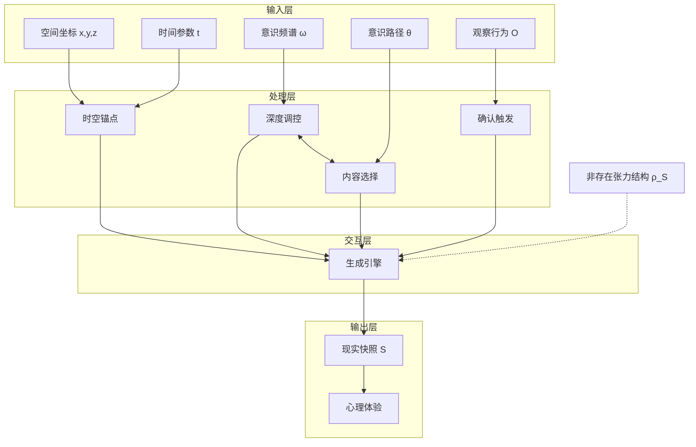

# Formula S | 核心生成公式

[](formula-S.en.md)

> **模块职责**：定义 MVM 的核心生成公式，统一所有意识参数与潜能映射  
> **依赖模块**：`core/meta-void/*`, `core/consciousness/*`, `engine/snapshot-service/*`  
> **被依赖于**：所有模块的理论基础

---

## 📋 Executive Summary

```
┌─────────────────────────────────────────────────────────────────────────┐
│           MVM 核心生成引擎公式 (Core Generation Formula)                 │
├─────────────────────────────────────────────────────────────────────────┤
│                                                                         │
│            ╔═════════════════════════════════════════════════╗         │
│            ║                                                 ║         │
│            ║       S := S(x, y, z | t | ω, θ, O)            ║         │
│            ║                                                 ║         │
│            ╚═════════════════════════════════════════════════╝         │
│                                                                         │
│  结构分解:                                                               │
│                                                                         │
│    [空间-时间层]    (x, y, z, t)  →  定位锚点："在哪里/什么时候"           │
│    [频谱调控层]     (ω)           →  深度调控："以何种状态/分辨率"         │
│    [路径选择层]     (θ)           →  内容选择："显现什么/连接什么"         │
│    [确认锁定层]     (O)           →  触发生成："执行确认/状态固化"         │
│                                                                         │
│  本质定位:                                                               │
│    这不是"描述公式"，而是"生成语法" (Generative Grammar)                 │
│    它定义的是"现实如何被创造"，而非"现实是什么"                            │
│                                                                         │
└─────────────────────────────────────────────────────────────────────────┘
```

---

## 1. 核心公理 (Formula Axioms)

### Axiom F.1 — 生成语法原理

```
┌─────────────────────────────────────────────────────────────────────────┐
│  AXIOM F.1  Generative Grammar Principle                               │
│                                                                         │
│  快照公式 S := S(x,y,z|t|ω,θ,O) 并非对现实状态的描述，                   │
│  而是现实被生成的"语法规则"。                                            │
│                                                                         │
│  类比:                                                                  │
│    如同语言的语法规定了哪些句子是合法的，                                 │
│    快照公式规定了哪些参数组合能够合法地生成有效的现实快照。                 │
│                                                                         │
│  推论: 宇宙不是预设的电影，而是实时渲染的互动体验                         │
│                                                                         │
└─────────────────────────────────────────────────────────────────────────┘
```

### Axiom F.2 — 参数协同原理

```
┌─────────────────────────────────────────────────────────────────────────┐
│  AXIOM F.2  Parameter Synergy Principle                                │
│                                                                         │
│  公式中的参数并非独立运作，而是处于动态协同平衡之中。                      │
│                                                                         │
│  协同关系:                                                              │
│    ω ⟷ θ : ω 调制 θ 的选择范围；θ 影响 ω 的状态                        │
│    (ω,θ) → O : O 的执行需要 ω 和 θ 达到协同阈值                        │
│    O → S : O 确认后，S 从叠加态塌缩为确定态                             │
│                                                                         │
│  结果: 每一帧现实都是所有参数协同运作的产物                               │
│                                                                         │
└─────────────────────────────────────────────────────────────────────────┘
```

### Axiom F.3 — 潜能映射原理

```
┌─────────────────────────────────────────────────────────────────────────┐
│  AXIOM F.3  Potentiality Mapping Principle                             │
│                                                                         │
│  公式直接作用于"非存在张力结构"，从中映射出现实快照。                      │
│                                                                         │
│  作用机制:                                                              │
│    θ → 触动潜能土壤，引发显现张力                                        │
│    ω → 影响激活阈值，决定响应深度                                        │
│    O → 在前震后的土壤上完成固化                                          │
│    S → 从潜能结构中"结晶"出的确定快照                                    │
│                                                                         │
│  推论: 公式是意识与潜能交互的"操作协议"                                   │
│                                                                         │
└─────────────────────────────────────────────────────────────────────────┘
```

---

## 2. 参数角色矩阵

### 2.1 结构化参数表

| 参数 | 角色 | 功能 | 隐喻 | 影响范围 | 详细定义 |
|------|------|------|------|----------|----------|
| **(x,y,z,t)** | 坐标定位器 | 提供生成的"锚点"与"实例化框架" | GPS/渲染坐标系 | 快照的时空位置 | [→ discrete-generation](../snapshot-service/discrete-generation.md) |
| **[ω](../../core/consciousness/spectrum-omega.md)** | 深度调控器 | 调制信息深度、结构层级、分辨率 | 显微镜倍率/VR调节 | 显现的"质感" | [→ spectrum-omega](../../core/consciousness/spectrum-omega.md) |
| **[θ](../../core/consciousness/path-theta.md)** | 内容导航器 | 选择调用哪些潜能接口，塑造快照形态 | 搜索引擎/API调用 | 显现的"内容" | [→ path-theta](../../core/consciousness/path-theta.md) |
| **O** | 确认触发器 | 执行最终确认，使叠加态塌缩为确定态 | 快门/提交按钮 | 显现的"发生" | [→ api-mapping](api-mapping.md) |

### 2.2 参数交互图



---

## 3. 生成场景示例

### 3.1 场景对比表

| 场景 | (x,y,z,t) | ω | θ | O | 生成的 S |
|------|-----------|---|---|---|----------|
| **品尝苹果** | 你与苹果的位置，此刻 | ωₗ (感官层) | 聚焦味觉、口感、香气 | 尝的动作 | 感官主导的体验快照 |
| **回忆童年** | 现在，但 θ 回溯到 t_past | ωₘ (记忆层) | 调用童年场景的潜能 | 触发点（气味/声音） | 记忆快照 |
| **解决数学题** | 书桌前，此刻 | ωₘ↔ωₕ 波动 | 在数学概念间探索 | "啊哈！"的瞬间 | 顿悟快照 |
| **深度冥想** | 身体位置，此刻 | ωₕ (顿悟层) | θ 放松，深度耦合 | 持续的安住 | 结构/本源层快照 |

### 3.2 生成流程图

```
生成流程 (每一帧):

  ┌──────────────┐
  │ 意识接口(你)  │
  └──────┬───────┘
         │
         ▼
  ┌──────────────────────────────────────────────────────────────┐
  │  Step 1: 定位                                                 │
  │  (x,y,z,t) 确定生成的时空锚点                                  │
  └──────────────────────────┬───────────────────────────────────┘
                             │
                             ▼
  ┌──────────────────────────────────────────────────────────────┐
  │  Step 2: 调频                                                 │
  │  ω 设定当前意识状态，决定可访问的潜能深度                        │
  └──────────────────────────┬───────────────────────────────────┘
                             │
                             ▼
  ┌──────────────────────────────────────────────────────────────┐
  │  Step 3: 选择                                                 │
  │  θ 在潜能接口图谱中导航，选择要调用的接口                        │
  └──────────────────────────┬───────────────────────────────────┘
                             │
                             ▼
  ┌──────────────────────────────────────────────────────────────┐
  │  Step 4: 酝酿 (前震)                                          │
  │  显现张力累积，多种可能性叠加                                   │
  └──────────────────────────┬───────────────────────────────────┘
                             │
                             ▼
  ┌──────────────────────────────────────────────────────────────┐
  │  Step 5: 确认                                                 │
  │  O 执行，叠加态塌缩，快照 S 生成并锁定                          │
  └──────────────────────────┬───────────────────────────────────┘
                             │
                             ▼
  ┌──────────────────────────────────────────────────────────────┐
  │  Step 6: 渲染                                                 │
  │  S 在意识接口中被解码为心理体验                                 │
  └──────────────────────────────────────────────────────────────┘
```

---

## 4. 宇宙积分模型 (概念性扩展)

### 4.1 从微观到宏观

```
┌─────────────────────────────────────────────────────────────────────────┐
│                宇宙积分模型 (Cosmic Integral Model)                     │
├─────────────────────────────────────────────────────────────────────────┤
│                                                                         │
│  核心思想:                                                              │
│    宏观现实 R ≠ 预设存在                                                │
│    宏观现实 R = 无数微观快照 S 的整合叠加效应                             │
│                                                                         │
│  概念公式:                                                              │
│                                                                         │
│    Reality(t) = ∫∫∫ S(x,y,z|t|ω,θ,O) · ρₛ(x,y,z) dV                   │
│                                                                         │
│    其中:                                                                │
│      ρₛ = 局部快照密度 (生成强度/复杂度)                                 │
│      dV = 无穷小结构体积                                                │
│      积分范围 = 意识可及的潜能空间                                       │
│                                                                         │
│  解释:                                                                  │
│    宇宙整体 = Σ 所有意识节点的所有快照生成事件                           │
│    客观性 = 大量路径在高概率区域的统计一致性                              │
│    演化 = 整体意识状态 Θ 与潜能分布 ρₛ 的动态变化                        │
│                                                                         │
└─────────────────────────────────────────────────────────────────────────┘
```

### 4.2 整体-局部关系

| 层级 | 描述 | 相关参数 |
|------|------|----------|
| **个体节点** | 单个意识接口的单帧快照生成 | S, ω, θ, O |
| **路径序列** | 个体的快照链 (现实流) | Sₙ₋₁ → Sₙ → Sₙ₊₁ |
| **集体效应** | 多节点的统计平均 | Θ (整体意识) |
| **宏观现实** | 所有生成事件的积分整合 | R ≈ ∫ f(Θ, ρₛ) |

---

## 5. 时间流逝感的本体论解释

### 5.1 核心洞见

```
┌─────────────────────────────────────────────────────────────────────────┐
│  时间的本质 (Temporal Essence)                                          │
├─────────────────────────────────────────────────────────────────────────┤
│                                                                         │
│  传统理解:                                                              │
│    时间 = 独立流动的物理维度                                             │
│    你 = 被时间河流载着漂流的乘客                                         │
│                                                                         │
│  MVM 理解:                                                              │
│    时间 = 快照链的序号系统 (t 是标记，非流动)                            │
│    流逝感 = 意识路径 θ 持续更新生成下一帧的"内在节奏"                     │
│    你 = 时间流逝感的生成者，而非被动经历者                               │
│                                                                         │
│  公式:                                                                  │
│    "现在" = 当前被渲染的帧 Sₙ                                           │
│    "流逝" = θ 从 Sₙ 到 Sₙ₊₁ 的更新动作                                  │
│                                                                         │
└─────────────────────────────────────────────────────────────────────────┘
```

### 5.2 主观时间速率的影响因素

| 因素 | 机制 | 主观感受 |
|------|------|----------|
| **高 ω + 丰富 θ** | 每帧信息量大，意识被内容填充 | 时间过得"快" (事后觉得"充实") |
| **低 ω + 重复 θ** | 每帧信息量少，更新缺乏新颖性 | 时间过得"慢" (无聊、等待) |
| **心流状态** | ω 稳定在最优区间，θ 深度耦合 | t 感消失 |
| **创伤/危机** | ω 急剧波动，θ 高速采样 | 时间膨胀 (慢动作) |

---

## 6. 核心洞见总结

> **Insight F.1** (Grammar, Not Description)  
> 快照公式是现实的"生成语法"，不是"状态描述"。它规定的是如何创造，而非是什么。

> **Insight F.2** (Synergy, Not Isolation)  
> 参数之间是协同运作的，每一帧都是时空定位、意识状态、路径选择、确认行为共同编排的结果。

> **Insight F.3** (Integration, Not Collection)  
> 宏观现实是微观快照的积分整合效应，客观性是统计一致性的涌现，而非预设属性。

> **Insight F.4** (Rhythm, Not Flow)  
> 时间流逝感是意识路径更新的"内在节奏"，而非外在时间的"客观流动"。

---

## 7. 导航索引

### 从本文档出发

| 如果你想了解... | 前往 |
|-----------------|------|
| 快照如何离散生成 | [→ ../snapshot-service/discrete-generation.md](../snapshot-service/discrete-generation.md) |
| 快照如何形成链条 | [→ ../snapshot-service/snapshot-chains.md](../snapshot-service/snapshot-chains.md) |
| API 映射类比 | [→ api-mapping.md](api-mapping.md) |
| 宇宙积分的详细讨论 | [→ integral-model.md](integral-model.md) |
| ω 参数的详细定义 | [→ ../../core/consciousness/spectrum-omega.md](../../core/consciousness/spectrum-omega.md) |
| θ 参数的详细定义 | [→ ../../core/consciousness/path-theta.md](../../core/consciousness/path-theta.md) |
| 潜能场结构 | [→ ../../core/meta-void/potentiality-field.md](../../core/meta-void/potentiality-field.md) |

### 术语速查

- **生成公式 S** → [glossary](../../assets/glossary.md#formula-s)
- **生成语法** → [glossary](../../assets/glossary.md#generative-grammar)
- **宇宙积分** → [glossary](../../assets/glossary.md#cosmic-integral)

---

## 📚 Research & Philosophical Notes

> *本节保留原著中关于"生成公式 S"的哲学思辨与案例论证，作为正文公理体系的感性补充。*

### Intuitive Analogies (直觉类比)

> **编程语言的语法**：如同语言的语法规定了哪些词语组合是合法的、有意义的句子，**快照公式规定了哪些参数组合（时空点、意识状态、路径选择、观察行为）能够合法地从非存在张力中生成一个有效的、可显现的现实快照**。它不是描述现实"是什么"，而是规定现实"如何被生成"。

> **烹饪食谱**：公式 S := S(x,y,z | t | ω, θ, O) 就像一道菜的食谱——(x,y,z,t) 是食材的位置和烹饪时间，ω 是火候的控制，θ 是选择哪些食材，O 是最终"出锅"的动作。**食谱本身不是菜，但它规定了如何做出这道菜。**

> **乐谱与演奏**：公式如同乐谱，定义了音符的组合规则。但**只有当演奏者（意识接口）实际演奏（执行参数组合）时，音乐才真正"响起"**——现实快照才真正"显现"。

### Case Studies (案例分析)

**品尝苹果（感官快照）**：
> 时空定位在你和苹果这里 (x,y,z,t)。你的意识主要处于低频 ωₗ（关注味觉、口感、香气）。意识路径 θ 聚焦于与"苹果"相关的感官潜能结构（颜色、形状、味道的结构模式）。最终的"尝"这个动作（O）确认并锁定了这次感官体验。**结果是生成了一系列以感官信息为主的现实快照。**

**解决数学难题（顿悟快照）**：
> 时空定位在书桌前 (x,y,z,t)。意识频谱 ω 可能在长时间的中频 β 波（逻辑推理）和短暂的高频 γ 波（整合、洞察）之间波动。意识路径 θ 在不同的数学概念、公理、解题策略的潜能结构之间探索、连接、尝试耦合。可能经历了多次"前震"（思路卡壳、灵感闪现）。最终，在高 ω 和 θ 聚焦于正确解法的瞬间，**一个内在的"啊哈！"（可视为 O）确认了解决方案**。

### Cross-disciplinary Dialogues (跨学科对话)

**与动力学方程的对话**：
> 快照公式与传统的动力学方程（如牛顿第二定律 F=ma 或薛定谔方程）有相似之处，都描述系统的变化规则。然而，**快照公式甚至比传统的动力学方程更进了一步——它不仅描述变化，更描述"生成"本身**。它试图揭示的是，现实并非在一个预先存在的时空中"演化"，而是如何从更基础的潜能结构中被"创造"或"显现"出来。

**与乔姆斯基生成语法的对话**：
> 语言学家乔姆斯基提出，语言的深层语法可能具有跨文化的普遍性。同样，**快照公式所揭示的生成语法，被认为是宇宙层面的、普遍适用于所有现实显现的基本规则**——尽管具体参数值千变万化，底层的生成逻辑是共享的。

### Open Questions (开放追问)

1. **公式的完备性**：当前公式是否已经捕捉了所有必要的生成参数？是否还存在我们尚未识别的"隐藏维度"？

2. **参数的量化**：ω、θ、O 目前主要是定性描述，是否可能在未来发展出某种"意识度量学"，使这些参数可以被精确量化？

3. **公式的统一性**：不同意识节点（人类、动物、甚至假设的外星智能）是否共享同一套生成公式，还是各有不同的"显现语法"？

> *← 返回 [公式的本质](#3-公式的本质生成语法而非静态描述)*

---

<div align="center">

*"公式不是描述宇宙的方程，而是宇宙生成自身的语法。每一帧，都是这套语法的一次执行。"*

</div>
