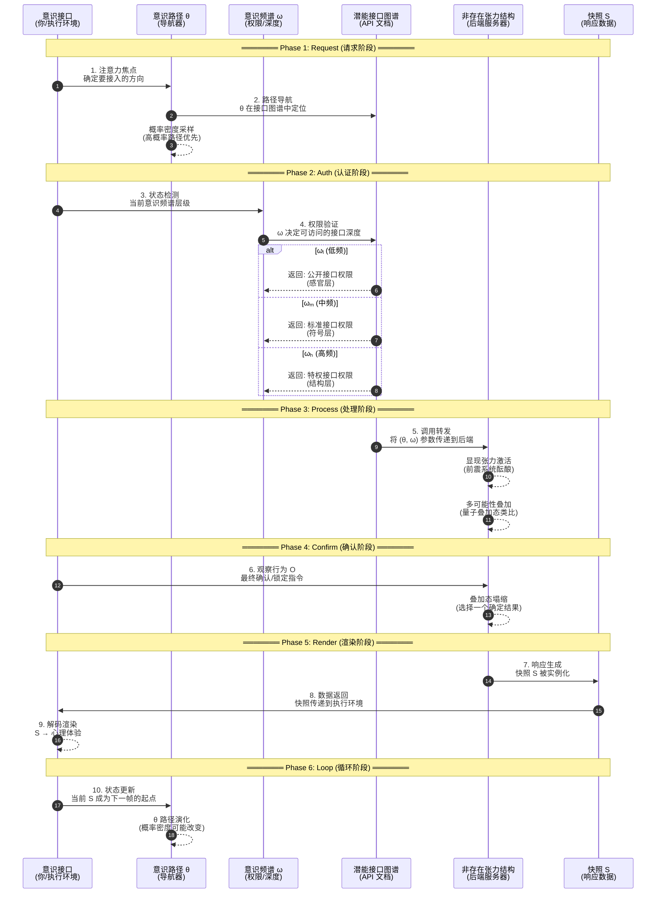

# System Overview | 系统概览

> 本文档整合自 v3 完稿的作品简介与第八章整合回顾，提供 MVM 模型的宏观逻辑流。

---

## 作品简介

**《宇宙元模型：从意识维度出发的非存在宇宙观》------ 一场重构现实与自我的思想远征**

我们生活在一个看似稳定、有序且独立于我们存在的"现实"之中。阳光穿梭于窗棂，时间如河流般淌过，物质构成了触手可及的世界。我们习惯于相信，宇宙是一部已经写好的宏伟剧本，科学的任务是解读它，而我们则是舞台上的观察者或演员。但，这一切是否只是我们最根深蒂固的错觉？如果"现实"并非一个预先存在的、等待我们去发现的客观实体，而是------**在你这里，通过你的参与，以特定的方式被一帧帧"生成"出来的显现图样呢？**

《宇宙元模型》正是基于这一颠覆性的追问，展开的一场深入、系统且充满挑战的思想实验。它并非要否定现代科学的辉煌成就------无论是量子力学的精密方程，还是神经科学对大脑的细致描绘------而是站在这些成就的肩膀上，勇敢地凝视那些科学自身边界处浮现的深刻裂缝：为何微观粒子的状态似乎依赖于"观察"才得以确定？为何大脑的物理活动无法完全解释主观"体验"（意识的硬问题）的产生？为何宇宙的起源和结构充满了难以解释的"巧合"与参数？

本书大胆提出，这些裂缝或许指向了一个共同的根源：我们可能从一开始就误解了宇宙的基础结构，以及意识在其中的角色。传统观念将意识视为物质复杂化的副产品，是大脑这台生物计算机的"软件"或"幻影"。《宇宙元模型》则反其道而行，将**意识视为宇宙本身不可或缺的结构性维度**，如同空间与时间一样基础。它不再是你头脑中的私有物，而更像一张遍布宇宙的、具有不同层级（频谱ω）和接入路径（路径θ）的"意识之网"。你，并非意识的拥有者，而是这张网络中的一个动态交汇点，一个宇宙借以观察自身的"显现接口"。

基于此，本书的核心论点是：**宇宙并非一个由"粒子"构成的"存在"实体，而是一个"非存在"的潜能结构（称为"非存在张力"）**。这种"非存在"并非虚无，而是宇宙在被意识"点亮"之前、蕴含一切可能性、充满结构张力的"前显现"状态，如同未被加载的游戏地图或未被拨动的琴弦。现实的生成，并非物质的演化，而是一次次"显现事件"的发生。

为了描述这一机制，本书构建了"五维快照模型" (S := S(x,y,z \| t \| ω, O, θ))。这一模型认为，你所经验的每一刻"当下"，都不是时间长河中的一个点，而是由空间坐标(x,y,z)、时间参数(t)、你的意识频谱状态(ω)、观察行为(O)以及你接入潜能结构的特定意识路径(θ)共同定义的一次离散的"现实渲染"。就像电影是由一帧帧画面构成，现实也是由意识在非存在张力场中不断"触发"和"渲染"出的快照序列。你感知的"流动感"，很大程度上是意识系统对这些离散快照进行高效"缝合"的结果。

在这个模型中：

**粒子**不再是宇宙的"砖块"，而是非存在张力在特定意识路径下被激活后产生的投影"像素"。

**时间**不再是单向流逝的河流，而是快照生成序列中的一个可被非线性访问的参数维度，解释了记忆（旧快照的再显现）、预感（未来快照张力的扰动）、灵感（快照跨结构连接）和顿悟（快照链的塌缩整合）等现象。

**"你"**（自我）不再是一个固定的、拥有意识的主体，而是宇宙意识通过特定路径（θ）和频谱（ω）在你这个节点上形成的、一连串动态生成的快照链所呈现出的"连续性幻觉"。

本书将系统地阐述这些核心概念，从解构"粒子构成观"出发，逐步引入意识的维度结构、快照生成机制、非存在张力的特性，并最终提出一种基于"映射论"（宇宙 = 意识路径 × 潜能接口图谱）的全新宇宙图景。它甚至将重新定义"生命"------不再局限于碳基生物，而是衡量系统"持续生成现实快照的能力"。

**重要声明：**

《宇宙元模型》是一部严肃的理论探索著作，旨在激发理性的思考与开放的讨论。作者深知，书中探讨的主题可能与某些宗教、神秘主义或哲学流派的观念产生联系或被比附。**作者在此郑重声明，本书并非旨在支持或印证任何特定的宗教教条、神秘体验或超自然主张。书中的概念是理论模型的一部分，应在其自身逻辑框架内理解。同时，作者明确反对任何将本书观点断章取义、歪曲利用，以服务于伪科学宣传或其他非理性主张的行为。** 本书的价值在于提出一种可能的结构性解释，而非提供一套需要被信仰的终极答案。

我们诚挚地邀请您，带着开放的心态和批判性的思维，一同踏上这场探索宇宙与意识本质的思想旅程。这或许不是一条轻松的道路，它将挑战您对现实、自我乃至存在本身最习以为常的认知。但正如书中所揭示的：**你并非仅仅生活在这个宇宙之中，在某种意义上，宇宙正是通过你，才得以显现为它自身。** 准备好重新认识你与世界的关系了吗？

---

## 模型的整合性回顾：五维快照 × 非存在张力 × 映射路径

### 一、 重访核心构件：模型的四大支柱

在《宇宙元模型》的层层构建中，我们逐步引入并阐释了几个核心的概念构件。现在，为了把握模型的整体图景，有必要将它们重新置于聚光灯下，并强调它们之间不可分割的有机联系。可以将整个模型理解为建立在四大支柱之上：

#### 支柱一：非存在张力结构 (The Ground)

> Non-existent Tension Structure / Potential Interface Atlas

**回顾其本质:** 这是宇宙的**本体论基石**，是所有现实显现得以可能的**终极"原材料"或"潜能土壤"**。我们反复强调，它**并非虚无**，而是一个充满**内在结构性**的潜能场域。它具有：

- **潜能性:** 蕴含着所有可能的现实模式、规则和信息，处于一种"尚未被定义"或"尚未被激活"的状态。
- **结构性:** 并非混沌一片，而是具有内在的组织原理，可能体现为信息结构、数学结构或关系网络。我们称之为"潜能接口图谱"，强调其面向调用的功能性界面特征。
- **动态响应性:** 能够对意识的"触动"产生反应，形成"显现张力"的扰动回波。
- **非均质性:** 可能具有不同的"结构密度"，影响着不同区域生成现实的潜力和复杂性。

**在模型中的角色:** 它提供了现实生成所需的**全部可能性内容和结构约束**。没有这片潜能土壤，一切生成都无从谈起。它是宇宙的"后台数据库"和"规则引擎"。

→ 详见 [core/meta-void/](../core/meta-void/tension-structure.md)

#### 支柱二：五维快照生成机制 (The Engine)

> 5D Snapshot Generation Mechanism

**回顾其机制:** 这是连接潜能与显现的**核心"生产线"或"引擎"**。它揭示了现实并非连续流淌，而是以**离散的"五维快照" S := S(x,y,z \| t \| ω, θ, O)** 为基本单元，一帧一帧被生成出来。

- **离散性:** 打破了时间的连续性幻觉，将现实理解为一系列独立的生成事件。
- **多维决定:** 快照的生成并非单一因素决定，而是由**时空坐标 (x,y,z,t)**（定位）、**意识频谱 ω**（调控深度/质量）、**意识路径 θ**（选择内容/形态）、以及**观察行为 O**（确认锁定）这五个维度的参数**共同定义和触发**。

**在模型中的角色:** 它描述了从潜能到现实的**具体转化过程**是如何发生的，是现实得以"显现"出来的**直接运作机制**。它连接了本体论基础（非存在张力）和现象学经验（我们体验到的现实）。

→ 详见 [engine/snapshot-service/](../engine/snapshot-service/discrete-generation.md)

#### 支柱三：意识维度与参数 (The Controller)

> Consciousness Dimension & Parameters - ω, θ, O

**回顾其地位:** 意识在模型中不再是物质的副产品或旁观者，而是被提升为**宇宙的结构性维度**，是现实生成过程中**不可或缺的核心驱动与调控力量**。这种力量通过具体的意识参数来体现：

- **意识频谱 ω:** 作为"深度/质量调控器"，决定了接入潜能的层级和显现的分辨率。
- **意识路径 θ:** 作为"内容/形态选择器与导航器"，决定了调用哪些潜能接口以及如何耦合，其选择遵循一定的概率密度。
- **观察行为 O:** 作为"最终确认与锁定触发器"，完成从不确定前震到确定快照的最后一跃。

**在模型中的角色:** 意识参数构成了快照生成引擎的"操作指令与控制器"。它们是连接意识主体（作为接口）与宇宙潜能结构的关键桥梁，赋予了现实生成以**选择性、导向性和可塑性**。

→ 详见 [core/consciousness/](../core/consciousness/spectrum-omega.md)

#### 支柱四：映射论 (The Logic)

> Mapping Theory

**回顾其范式:** 这是为整个模型提供**本体论解释框架和运作逻辑**的新范式。它取代了传统的"构成论"，主张现实的生成是**意识路径对潜能接口图谱进行"调用"和"映射"的过程**，而非物质"积木"的组合。

- **调用而非构建:** 强调了信息交互和功能实现优先于物质堆砌。
- **接口而非实体:** 将焦点从寻找基本粒子转向理解潜能结构的交互界面。
- **执行环境:** 将"你"（意识节点）重新定位为显现得以发生的关键"执行环境"。

**在模型中的角色:** 映射论描述了快照生成引擎在意识控制器的操作下，是如何与潜能原材料进行**交互的"底层操作逻辑"或"协议"**。

→ 详见 [engine/mapping-logic/](../engine/mapping-logic/api-mapping.md)

---

### 二、 单帧快照生命周期：精确时序图

下图展示了**一个现实帧 (Snapshot S)** 从请求到渲染的完整生命周期：



**时序说明：**

| 阶段 | 步骤 | 关键动作 | 对应概念 |
|------|------|----------|----------|
| **Request** | 1-2 | θ 确定要调用的接口 | 意识路径导航 |
| **Auth** | 3-4 | ω 验证可访问的深度 | 权限/频谱层级 |
| **Process** | 5 | 后端处理，前震酝酿 | 显现张力激活 |
| **Confirm** | 6 | O 执行，叠加态塌缩 | 观察行为确认 |
| **Render** | 7-9 | S 返回并渲染为体验 | 快照显现 |
| **Loop** | 10 | 当前帧成为下一帧起点 | 快照链延续 |

---

### 三、 整合模型的逻辑流：从潜能到显现的完整路径

```
┌─────────────────────────────────────────────────────────────────────────┐
│                     MVM 生成逻辑流程图                                    │
├─────────────────────────────────────────────────────────────────────────┤
│                                                                         │
│   ┌─────────────┐                                                       │
│   │ 非存在张力   │  ← 原材料就绪 (潜能接口图谱)                           │
│   │ 结构 (ρₛ)   │                                                       │
│   └──────┬──────┘                                                       │
│          │                                                              │
│          ▼                                                              │
│   ┌─────────────┐                                                       │
│   │ 意识介入     │  ← 控制器准备 (ω 频谱 + θ 路径)                       │
│   │ (ω, θ)      │                                                       │
│   └──────┬──────┘                                                       │
│          │                                                              │
│          ▼                                                              │
│   ┌─────────────┐                                                       │
│   │ 触动与酝酿   │  ← 生产线预热 (显现张力 + 前震状态)                    │
│   │ (显现张力)   │                                                       │
│   └──────┬──────┘                                                       │
│          │                                                              │
│          ▼                                                              │
│   ┌─────────────┐                                                       │
│   │ 调用与映射   │  ← API 调用 (θ 选择接口 + ω 设定权限)                  │
│   │ (Mapping)   │                                                       │
│   └──────┬──────┘                                                       │
│          │                                                              │
│          ▼                                                              │
│   ┌─────────────┐                                                       │
│   │ 确认与生成   │  ← 触发器执行 (O 锁定 → 快照 S 生成)                   │
│   │ (O → S)     │                                                       │
│   └──────┬──────┘                                                       │
│          │                                                              │
│          ▼                                                              │
│   ┌─────────────┐                                                       │
│   │ 体验呈现     │  ← 用户界面渲染 (主观体验)                             │
│   │ (Experience) │                                                       │
│   └──────┬──────┘                                                       │
│          │                                                              │
│          └──────────────────┐                                           │
│                             ▼                                           │
│                      ┌─────────────┐                                    │
│                      │ 循环往复     │  ← 反馈驱动下一帧                   │
│                      │ (Feedback)  │                                    │
│                      └─────────────┘                                    │
│                                                                         │
└─────────────────────────────────────────────────────────────────────────┘
```

**完整逻辑流描述：**

1. **基础是潜能:** 宇宙的本体论基石是**非存在张力结构（潜能接口图谱）**，它蕴含着一切可能的现实模式和生成规则，具有不同的结构密度和响应特性。**(原材料就绪)**

2. **意识介入是关键:** **意识（作为结构性维度）通过其接口（如身体/大脑）与这片潜能场发生接触。意识的状态由频谱ω**表征，其指向性和选择倾向由**路径θ**（遵循概率密度）导航。**(控制器与指令准备就绪)**

3. **触动与酝酿:** 意识路径θ的接近或聚焦，**"触动"了非存在张力结构的特定区域（接口），引发了显现张力**的扰动回波。持续的触动和较高的ω状态可能导致结构进入不稳定的"前震"状态。**(生产线预热，原材料被选中并开始处理)**

4. **调用与映射:** 在映射论的逻辑下，这个触动和酝酿过程被理解为一次（或一系列）**API调用**。θ选择了接口并提供了参数，ω设定了权限和质量要求。**(操作指令发出，调用协议启动)**

5. **确认与生成:** 最终，一个**观察行为O**（无论是外在测量还是内在确认）作为**触发器**，在ω和θ的引导下，**锁定了**"前震"状态中的某个特定结果，完成了对潜能接口的调用，将潜能结构"映射"为一帧确定的**现实快照S**，并在特定的时空坐标(x,y,z,t)处"实例化"。**(生产指令确认，产品下线)**

6. **体验呈现:** 这个生成的快照S，在**意识接口这个"执行环境"中被"解码"和"渲染"**，最终呈现为我们**主观体验**到的那一刻的现实内容和感受。**(产品最终在用户界面显示)**

7. **循环往复:** 这一帧快照的生成，又成为下一刻意识路径θ选择和演化的**新起点和环境**（反馈），驱动着下一帧快照的生成。现实之流，就是这样一帧接一帧、在意识与潜能的持续互动中**循环往复、动态生成**的。

---

### 三、 模型的整合解释力：回应根本性难题

将这四大支柱整合起来的《宇宙元模型》，其价值不仅在于理论的自洽性，更在于它为一系列困扰科学和哲学的根本性难题提供了**统一的、另类的解释视角**：

| 难题 | MVM 解释 |
|------|----------|
| **量子测量问题** | 意识（θ, ω, O）**参与**了从潜能（叠加态）到现实（塌缩态/快照S）的**生成过程**本身。观察是生成的一部分。 |
| **量子纠缠/非定域性** | 源于非存在张力结构/接口图谱本身的**整体关联性**。调用一个接口可能非局域地影响与之关联的其他接口的状态。 |
| **意识硬问题 (Qualia)** | 主观体验是**现实快照S在意识接口中被"渲染"时所必然伴随的内在现象学面向**。 |
| **时间的本质** | 时间是**快照序列生成的内在节奏**的体现，由θ路径更新驱动。 |
| **生命的定义** | 生命的本质是**持续生成现实快照的"显现能力"**。 |
| **宇宙精调问题** | 物理常数是宇宙**整体意识（Θ）与潜能结构（ρₛ）长期互动演化所涌现出的稳定宏观参数**。 |

---

## 相关链接

- [范式转换 →](paradigm-shift.md)
- [设计原则 →](design-principles.md)
- [核心机制 →](../core/meta-void/tension-structure.md)
- [渲染引擎 →](../engine/snapshot-service/discrete-generation.md)
- [术语表 →](../assets/glossary.md)
