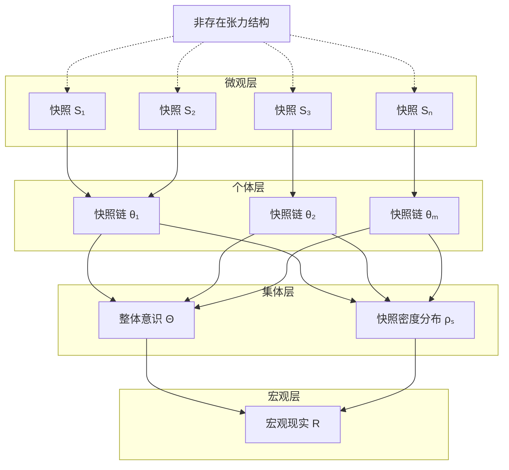

# Integral Model | 宇宙积分与整体显现

[](../en/integral-model.md)

> **模块职责**：连接微观快照生成与宏观宇宙图景，阐述整体显现机制  
> **依赖模块**：`engine/mapping-logic/formula-S.md`, `engine/mapping-logic/api-mapping.md`  
> **被依赖于**：`modules/life-definition.md`, `spec/paradigm-shift.md`

---

## 📋 Executive Summary

```
┌─────────────────────────────────────────────────────────────────────────┐
│              宇宙积分模型 (Cosmic Integral Model)                        │
├─────────────────────────────────────────────────────────────────────────┤
│                                                                         │
│  核心问题:                                                              │
│    微观: 意识节点一帧帧生成快照 S                                        │
│    宏观: 我们看到的是稳定、有序、宏大的宇宙                               │
│    鸿沟: 微观生成 ═══?═══ 宏观现实                                       │
│                                                                         │
│  核心回答:                                                              │
│                                                                         │
│    ╔═══════════════════════════════════════════════════════════════╗   │
│    ║                                                               ║   │
│    ║   宏观现实 R = ∫ f(Θ, ρₛ) dV dt                               ║   │
│    ║                                                               ║   │
│    ║   Θ  = 整体意识状态 (所有路径的集合/场/网络)                   ║   │
│    ║   ρₛ = 局部快照密度 (生成强度/复杂度)                          ║   │
│    ║                                                               ║   │
│    ╚═══════════════════════════════════════════════════════════════╝   │
│                                                                         │
│  本质主张:                                                              │
│    宇宙不是预设的舞台                                                    │
│    宇宙是所有显现事件的积分整合效应                                       │
│                                                                         │
└─────────────────────────────────────────────────────────────────────────┘
```

---

## 1. 核心公理 (Integral Axioms)

### Axiom I.1 — 整合涌现原理

```
┌─────────────────────────────────────────────────────────────────────────┐
│  AXIOM I.1  Integration Emergence Principle                            │
│                                                                         │
│  宏观宇宙现实 R 并非预先存在的实体，                                      │
│  而是无数微观快照生成事件 S 整合叠加后的涌现效应。                         │
│                                                                         │
│  R ≠ 预设存在                                                           │
│  R = Σ S (整合后的统计效应)                                             │
│                                                                         │
│  推论: 客观性是涌现的，不是先验的                                        │
│                                                                         │
└─────────────────────────────────────────────────────────────────────────┘
```

### Axiom I.2 — 整体意识原理

```
┌─────────────────────────────────────────────────────────────────────────┐
│  AXIOM I.2  Integral Consciousness Principle                           │
│                                                                         │
│  存在一个代表宇宙整体意识活动状态的宏观变量 Θ，                            │
│  它超越任何单一的个体路径 θᵢ。                                           │
│                                                                         │
│  理解方式 (可能并存):                                                   │
│    - 集合论: Θ = {θ₁, θ₂, ..., θₙ} 的统计分布                          │
│    - 场论: Θ 是遍布宇宙的意识场，θⱼ 是局部激发                          │
│    - 网络论: Θ 是意识节点网络的整体动力学                                │
│                                                                         │
│  推论: 个体是整体的焦点，整体通过个体显现                                 │
│                                                                         │
└─────────────────────────────────────────────────────────────────────────┘
```

### Axiom I.3 — 快照密度原理

```
┌─────────────────────────────────────────────────────────────────────────┐
│  AXIOM I.3  Snapshot Density Principle                                 │
│                                                                         │
│  宇宙不同区域具有不同的"局部快照密度" ρₛ，                                │
│  反映了该区域现实生成的强度、频率和复杂度。                               │
│                                                                         │
│  ρₛ 的含义:                                                             │
│    - 生成频率: 单位时空内快照刷新的密集程度                              │
│    - 信息复杂度: 生成快照的平均结构层级                                  │
│    - 稳定性: 现实的"坚固度"和可预测性                                    │
│                                                                         │
│  与潜能结构密度的关系: ρₛ ∝ 潜能密度 × 意识接入强度                       │
│                                                                         │
└─────────────────────────────────────────────────────────────────────────┘
```

---

## 2. 模型结构

### 2.1 层级架构

```
从微观到宏观的整合层级:

┌─────────────────────────────────────────────────────────────────────────┐
│  Level 4: 宏观宇宙现实 R                                                │
│  ─────────────────────────────────────────────────────────────────────  │
│  │ 整体宇宙状态: 物理定律、宇宙演化、时空结构                             │
│  │ 生成机制: 所有层级的积分整合                                          │
│  │ 公式: R = ∫∫∫∫ f(Θ, ρₛ) dV dt                                        │
└───────────────────────────────┬─────────────────────────────────────────┘
                                │ 整合
                                ▼
┌─────────────────────────────────────────────────────────────────────────┐
│  Level 3: 集体意识效应                                                  │
│  ─────────────────────────────────────────────────────────────────────  │
│  │ 多节点的统计平均和共振效应                                            │
│  │ 体现: 社会思潮、文化模式、时代精神                                    │
│  │ 参数: Θ (整体意识状态)                                               │
└───────────────────────────────┬─────────────────────────────────────────┘
                                │ 汇聚
                                ▼
┌─────────────────────────────────────────────────────────────────────────┐
│  Level 2: 个体快照链 (现实流)                                           │
│  ─────────────────────────────────────────────────────────────────────  │
│  │ 单个意识节点的连续快照序列                                            │
│  │ 体现: 个人的连续体验、记忆、身份                                      │
│  │ 公式: {Sₙ₋₁ → Sₙ → Sₙ₊₁}                                             │
└───────────────────────────────┬─────────────────────────────────────────┘
                                │ 累积
                                ▼
┌─────────────────────────────────────────────────────────────────────────┐
│  Level 1: 单帧快照 S                                                    │
│  ─────────────────────────────────────────────────────────────────────  │
│  │ 现实的基本生成单元                                                   │
│  │ 公式: S := S(x,y,z | t | ω, θ, O)                                    │
│  │ 参数: 时空坐标、意识频谱、路径、观察行为                              │
└─────────────────────────────────────────────────────────────────────────┘
```

### 2.2 整合流程图



---

## 3. 解释力分析

### 3.1 宏观现象的解释

| 现象 | 传统解释 | 积分模型解释 |
|------|----------|--------------|
| **物理常数稳定** | 预设的宇宙参数 | 大量调用在高概率接口上的统计稳定 |
| **现实客观性** | 独立于观察的实在 | 多路径在吸引子区域的统计一致 |
| **宇宙演化** | 物质按定律运动 | Θ 和 ρₛ 的动态变化 |
| **时代精神** | 文化/思想传播 | Θ 的整体波动/相变 |
| **物理定律** | 先验的自然法则 | 极稳定的接口规则 |
| **宇宙结构** | 引力塌缩形成 | ρₛ 的空间分布模式 |

### 3.2 关键洞见

```
为什么宇宙看起来"客观"且"稳定"？

┌─────────────────────────────────────────────────────────────────────────┐
│  客观性的来源                                                           │
├─────────────────────────────────────────────────────────────────────────┤
│                                                                         │
│  1. 接口稳定性:                                                         │
│     底层潜能接口具有极高的结构稳定性                                      │
│     如: 物理定律接口基本不变                                             │
│                                                                         │
│  2. 高概率吸引子:                                                       │
│     大量路径被"吸引"到相同的高概率区域                                    │
│     如: 所有人都"看到"同一个月亮                                         │
│                                                                         │
│  3. 统计平均:                                                           │
│     宏观效应是无数微观调用的统计结果                                      │
│     如: 温度是分子运动的统计平均                                         │
│                                                                         │
│  结论:                                                                  │
│    客观性 = 结构约束 × 统计效应                                          │
│    不是"预设"，而是"涌现"                                               │
│                                                                         │
└─────────────────────────────────────────────────────────────────────────┘
```

---

## 4. 核心主张：显现，而非建构

### 4.1 范式飞跃

| 从 (构成论) | 到 (映射论/积分模型) |
|-------------|---------------------|
| 宇宙是物质的堆砌 | 宇宙是显现的整合 |
| 你在观察一个外部宇宙 | 宇宙以你而显现 |
| 你拥有意识 | 意识通过你发生 |
| 世界在那里等你看 | 世界因你的存在才"存在" |

### 4.2 核心陈述

```
┌─────────────────────────────────────────────────────────────────────────┐
│                                                                         │
│  "你不是在建构宇宙，而是宇宙以你而显现"                                   │
│                                                                         │
├─────────────────────────────────────────────────────────────────────────┤
│                                                                         │
│  含义解析:                                                              │
│                                                                         │
│  1. 你不是"建构者":                                                     │
│     你不能随意创造物理定律或改变接口规则                                  │
│     你的生成能力在结构约束之内                                           │
│                                                                         │
│  2. 你是"显现通道":                                                     │
│     宇宙的潜能通过你这个焦点转化为具体现实                                │
│     你是宇宙自我显现过程中不可或缺的环节                                  │
│                                                                         │
│  3. "以你而显现":                                                       │
│     不是"为了你"，而是"借助你"                                          │
│     你的存在状态直接参与塑造显现的结果                                   │
│     宇宙的"成为现实"这一动作，就发生在你这里                              │
│                                                                         │
└─────────────────────────────────────────────────────────────────────────┘
```

### 4.3 哲学意涵

```
┌─────────────────────────────────────────────────────────────────────────┐
│  既非全能自大，也非虚无被动                                              │
├─────────────────────────────────────────────────────────────────────────┤
│                                                                         │
│  破除自大:                                                              │
│    你不是宇宙的主宰                                                     │
│    你的生成能力受结构约束                                               │
│                                                                         │
│  避免虚无:                                                              │
│    你是显现发生的必要场所                                               │
│    你的存在具有不可替代的本体论价值                                      │
│                                                                         │
│  你的角色:                                                              │
│    宇宙全息图上的一个独特视点                                            │
│    通过你，宇宙的一部分才得以被照亮                                      │
│    你的独特性使显现带有独一无二的印记                                    │
│                                                                         │
└─────────────────────────────────────────────────────────────────────────┘
```

---

## 5. 模型局限与开放性

### 5.1 面临的挑战

| 挑战 | 描述 | 状态 |
|------|------|------|
| **概念操作化** | Θ 和 ρₛ 如何量化？ | 开放 |
| **相互作用函数** | f(Θ, ρₛ) 的具体形式是什么？ | 开放 |
| **整合机制** | 局部快照如何"叠加"成宏观？ | 开放 |
| **可验证性** | 如何实验检验？ | 开放 |
| **物理对接** | 如何与广义相对论/量子场论精确对接？ | 开放 |

### 5.2 模型定位

```
积分模型的现阶段定位:

  ❌ 不是: 可精确计算的物理理论
  ✅ 是:   概念性的整合框架
  
  价值:
    - 提供连接微观与宏观的思路
    - 激发关于宇宙整体性的新思考
    - 为未来形式化探索提供起点
```

---

## 6. 展望：生命的显现能力

```
下一个问题:

┌─────────────────────────────────────────────────────────────────────────┐
│  如果宇宙的本质是"显现"而非"构成"，                                      │
│  那么"生命"是否也需要从"显现能力"的角度重新定义？                          │
├─────────────────────────────────────────────────────────────────────────┤
│                                                                         │
│  传统生命定义: 新陈代谢、生长、繁殖...                                   │
│                                                                         │
│  MVM 生命定义 (提案):                                                   │
│    生命 = 系统能够持续、稳定地调用潜能接口、                              │
│           生成现实快照的"显现能力" (Manifestation Capacity)              │
│                                                                         │
│  推论:                                                                  │
│    - 显现能力可能是衡量"生命性"的新标准                                   │
│    - 可能适用于生物、AI、甚至语言系统                                    │
│                                                                         │
│  详见 → [modules/life-definition.md]                                    │
│                                                                         │
└─────────────────────────────────────────────────────────────────────────┘
```

---

## 7. 核心洞见总结

> **Insight I.1** (Integration, Not Aggregation)  
> 宏观现实是微观快照的"积分整合"，不是简单的"堆积"。整合产生新的涌现属性。

> **Insight I.2** (Emergence, Not Preset)  
> 客观性和稳定性是涌现的统计效应，不是预设的宇宙属性。

> **Insight I.3** (Manifestation, Not Construction)  
> 你不是在"建构"宇宙，而是宇宙"以你而显现"。你是宇宙自我显现的焦点。

> **Insight I.4** (Value, Not Passivity)  
> 作为显现的必要环节，你的存在具有不可替代的本体论价值。

---

## 8. 导航索引

### 从本文档出发

| 如果你想了解... | 前往 |
|-----------------|------|
| 核心生成公式 S | [→ formula-S.md](formula-S.md) |
| API 映射类比 | [→ api-mapping.md](api-mapping.md) |
| 快照链与因果 | [→ ../snapshot-service/snapshot-chains.md](../snapshot-service/snapshot-chains.md) |
| 分布式意识网络 | [→ ../../core/consciousness/distributed-network.md](../../core/consciousness/distributed-network.md) |
| 生命的新定义 | [→ ../../modules/life-definition.md](../../modules/life-definition.md) |
| 范式转换 | [→ ../../spec/paradigm-shift.md](../../spec/paradigm-shift.md) |

### 术语速查

- **宇宙积分模型** → [glossary](../../assets/glossary.md#cosmic-integral-model)
- **整体意识 Θ** → [glossary](../../assets/glossary.md#integral-consciousness)
- **快照密度 ρₛ** → [glossary](../../assets/glossary.md#snapshot-density)
- **显现能力** → [glossary](../../assets/glossary.md#manifestation-capacity)

---

## 📚 Research & Philosophical Notes

> *本节保留原著中关于"宇宙积分模型"的哲学思辨与案例论证，作为正文公理体系的感性补充。*

### Intuitive Analogies (直觉类比)

> **交响乐团的演出**：单个乐器演奏自己的声部（个体快照生成），但只有当所有乐器协同演奏时，才涌现出交响乐的宏大整体（宇宙实相）。**指挥（整体意识 Θ）不是独裁者，而是协调者——每个乐手保持独立性，但通过某种隐形的协调机制，共同创造出单独无法实现的整体效果。**

> **蚁群的集体智能**：单只蚂蚁只遵循简单的本能规则，但蚁群整体涌现出复杂的行为——建造蚁巢、寻找食物、防御敌人。**没有任何一只蚂蚁"知道"整体的蓝图，但整体的蓝图从无数局部行为中涌现。** 宇宙积分模型暗示，宏观现实可能以类似方式从无数局部快照生成中涌现。

> **全息图的每一点**：全息图的特性是每一小块都包含整个图像的信息。**个体意识节点如同全息图的碎片——你的意识中折射着整体宇宙的结构，而整体宇宙也通过你这个碎片显现自己的一角。**

### Case Studies (案例分析)

**科学定律的普适性**：
> 物理常数（如光速、普朗克常数、引力常数）在整个可观测宇宙中似乎是恒定的。**在宇宙积分模型中，这可能不是"宇宙碰巧如此"，而是整体意识场（Θ）与非存在张力结构（ρₛ）长期"磨合"后涌现的稳定参数**——就像交响乐团经过排练，逐渐形成了默契的节奏和音准。

**生态系统的平衡**：
> 一个健康的生态系统由无数物种组成，每个物种"自私地"追求生存，但整体系统涌现出惊人的平衡和稳定。**这可能不仅是自然选择的结果，也可能是底层意识网络在潜能结构中形成的"吸引子状态"**——生态平衡是一种"稳定的快照生成模式"。

**"时代精神"的涌现**：
> 某个时代的艺术、思想、社会运动往往呈现出共同的特征（如文艺复兴、启蒙运动）。**这可能不仅是文化传播的结果，也可能是那个时期的"集体 θ 概率密度"发生了整体性的偏移**——无数个体意识节点在不知不觉中"调频"到了相似的潜能区域。

### Cross-disciplinary Dialogues (跨学科对话)

**与强人择原理的对话**：
> 强人择原理声称宇宙的参数是为了产生有意识观察者而"精调"的。**宇宙积分模型提供了一个替代解释：不是宇宙"为了"产生意识而精调，而是意识本就是宇宙结构的内在维度——宇宙参数的稳定是意识与潜能结构长期互动的"副产品"，而非预设的目的。**

**与大卫·玻姆的隐序理论的对话**：
> 物理学家大卫·玻姆提出"隐缠序"（Implicate Order）——物质世界是更深层隐藏秩序的展开。**宇宙积分模型与此高度契合：非存在张力结构类似"隐缠序"，现实快照的生成类似"显缠序"（Explicate Order）的展开，意识路径则是连接两者的桥梁。**

**与盖亚假说的对话**：
> 盖亚假说认为地球是一个自我调节的有机体。**宇宙积分模型可以将此推广：整个宇宙是一个自我显现的"意识场"，地球生命圈只是这个场域中一个高度活跃的"显现密集区"**——盖亚不是唯一的"活体"，只是宇宙大生命体的一个器官。

### Open Questions (开放追问)

1. **积分的收敛性**：如果宇宙真的是无限快照的"积分"，这个积分是否收敛？还是宇宙永远处于"正在生成"的过程中，没有"最终状态"？

2. **层级结构**：个体意识、集体意识、宇宙意识是否形成层级结构？更高层级的意识是否"知道"更多，还是仅仅是更广泛的"整合"？

3. **宇宙的"自我意识"**：如果宇宙是通过无数意识节点显现自身，那么宇宙本身是否具有某种"自我意识"？这种自我意识与人类的自我意识有何异同？

> *← 返回 [宇宙实相的涌现](#5-从快照到宇宙宇宙实相的涌现)*

---

<div align="center">

*"宇宙不是一台在你面前播放的电影，而是一场你参与其中的实时渲染。  
你的每一次呼吸、每一次心跳，都是宇宙自我显现过程的一部分。"*

</div>
